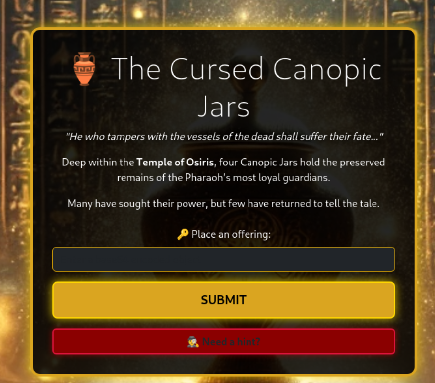

# Intro


# Information gathering


Pressing the button "Enter the Chamber" redirects the user ```/canopic_jar``` which displays the main CTF application containing a input field, submit button and a "Need a hint?" button.  



Pressing the "Need a hint?" button adds ```?hint=true``` to ```/canopic_jars``` which displays the hint for the user.   


The hint tells the user that JSON should be used as payload. The JSON key must be "token" and that the "offering" should be base64 encoded. Only the on who knows the  "ancient_secret" hints of that this is the value to the "token" key. 

# Attack
The JSON payload is able to be base64 encoded using the Decoder in BurpSuite.
```JSON
{"token":"ancient_secret"}
```
```eyJ0b2tlbiI6ImFuY2llbnRfc2VjcmV0In0=```  


Submitting the base64 encoded payload makes the application return the flag to the user at the bottom of the container.  


```Flag: O24{soul_of_osiris_bound_within_the_cursed_vessel}```