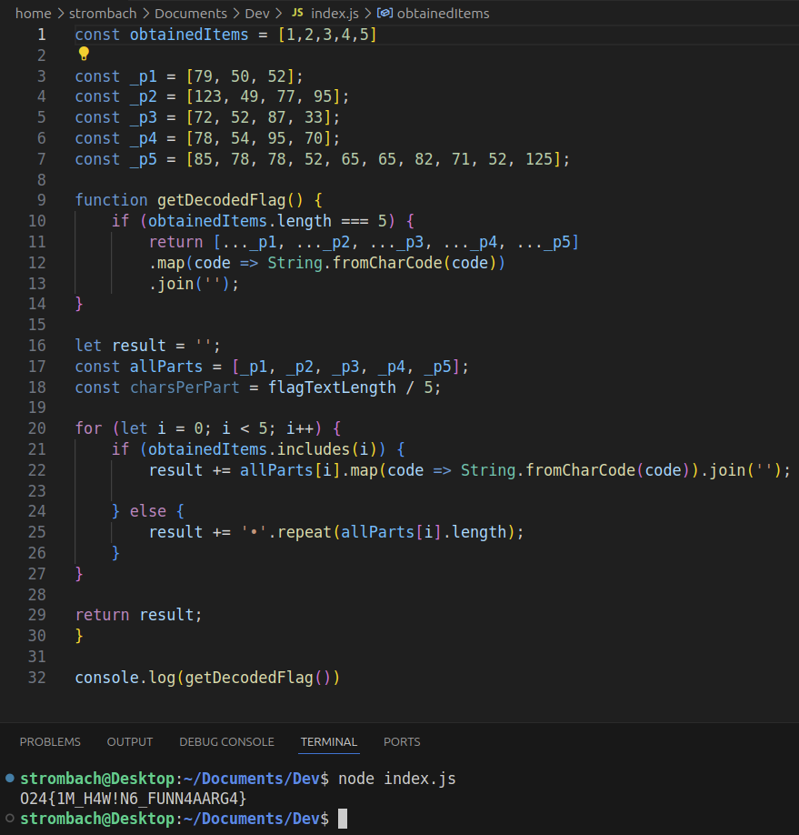

# Information gathering
The user is presenting with a game. And after dying x number of times cheating becomes a valid options.  


In the JavaScript source code a function that is called ```getDecodedFlag```. And checking the code of the function it's clear that the ```_p``` variables is part of the flag. So the if statement tells that if an something called ```obtainedItems``` contains five characters or elements.
```javascript
    const _p1 = [79, 50, 52];
    const _p2 = [123, 49, 77, 95];
    const _p3 = [72, 52, 87, 33];
    const _p4 = [78, 54, 95, 70];
    const _p5 = [85, 78, 78, 52, 65, 65, 82, 71, 52, 125];
    
    function getDecodedFlag() {
        if (obtainedItems.length === 5) {
            return [..._p1, ..._p2, ..._p3, ..._p4, ..._p5]
                .map(code => String.fromCharCode(code))
                .join('');
        }
        
        let result = '';
        const allParts = [_p1, _p2, _p3, _p4, _p5];
        const charsPerPart = flagTextLength / 5;
        
        for (let i = 0; i < 5; i++) {
            if (obtainedItems.includes(i)) {
                result += allParts[i].map(code => String.fromCharCode(code)).join('');
            } else {
                result += '•'.repeat(allParts[i].length);
            }
        }
        
        return result;
    }
    
```


And running the function in node an error occurs that proves that ```obtainedItems``` is needed.  


By searching the complete code, a cheater could say that the variable should be an Array.   


So after adding the Array with five elements, the code executes and adding a ```console.log()``` it's possible to print the flag to the console.


```javascript
	const obtainedItems = [1,2,3,4,5]

	const _p1 = [79, 50, 52];
    const _p2 = [123, 49, 77, 95];
    const _p3 = [72, 52, 87, 33];
    const _p4 = [78, 54, 95, 70];
    const _p5 = [85, 78, 78, 52, 65, 65, 82, 71, 52, 125];
    
    function getDecodedFlag() {
        if (obtainedItems.length === 5) {
            return [..._p1, ..._p2, ..._p3, ..._p4, ..._p5]
                .map(code => String.fromCharCode(code))
                .join('');
        }
        
        let result = '';
        const allParts = [_p1, _p2, _p3, _p4, _p5];
        const charsPerPart = flagTextLength / 5;
        
        for (let i = 0; i < 5; i++) {
            if (obtainedItems.includes(i)) {
                result += allParts[i].map(code => String.fromCharCode(code)).join('');
            } else {
                result += '•'.repeat(allParts[i].length);
            }
        }
        
        return result;
    }
    
console.log(getDecodedFlag())
```


```Flag: O24{1M_H4W!N6_FUNN4AARG4}```