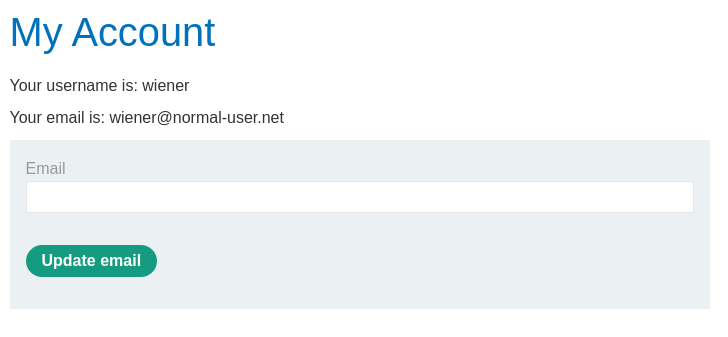

# Lab: CSRF where token is not tied to user session
This lab's email change functionality is vulnerable to CSRF. It uses tokens to try to prevent CSRF attacks, but they aren't integrated into the site's session handling system.

To solve the lab, use your exploit server to host an HTML page that uses a CSRF attack to change the viewer's email address.

You have two accounts on the application that you can use to help design your attack. The credentials are as follows:

- wiener:peter
- carlos:montoya

# Solution
We login and  check the HTML as usual. But this time we make a request for changing the email to get a look at the "change-email request" so we can manipulate it.  

Now we login in to the second provided account in a private browser window and steal the csrf token generated for the change email form.  

Now we use the stolen token to make a new "change-email request" for our first user. This is to check if the csrf-token is connected to a user session. If we can change the email with carlos token, then the token isn't tied to a user session and anybody with a token could change another users email.  
The request made to the wiener account but with carlos token.  

And it worked.  

So let's take wiener's csrf token to create a exploit to deliver to the victim.  

