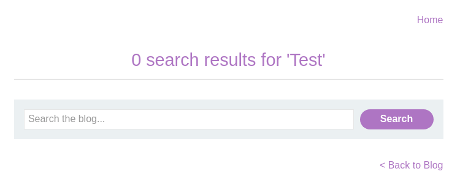
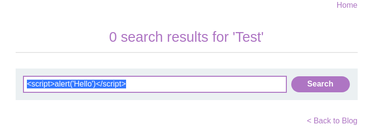
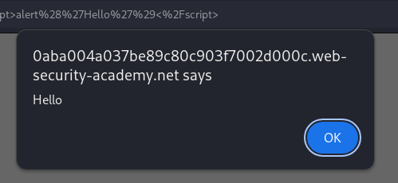

# Lab: Reflected XSS into HTML context with nothing encoded
This lab contains a simple reflected cross-site scripting vulnerability in the search functionality.

To solve the lab, perform a cross-site scripting attack that calls the alert function.

# Solution

First we get presented with a search box and a list of blog posts.  


Searching for something returns the search term in a text field above the search box.   


And a query is added to the URL.
```/?search=Test```


Let's test to add a script tag to the search box.  



And the input doesn't seem to sanitize any input and the ```alert``` function is executed.  
