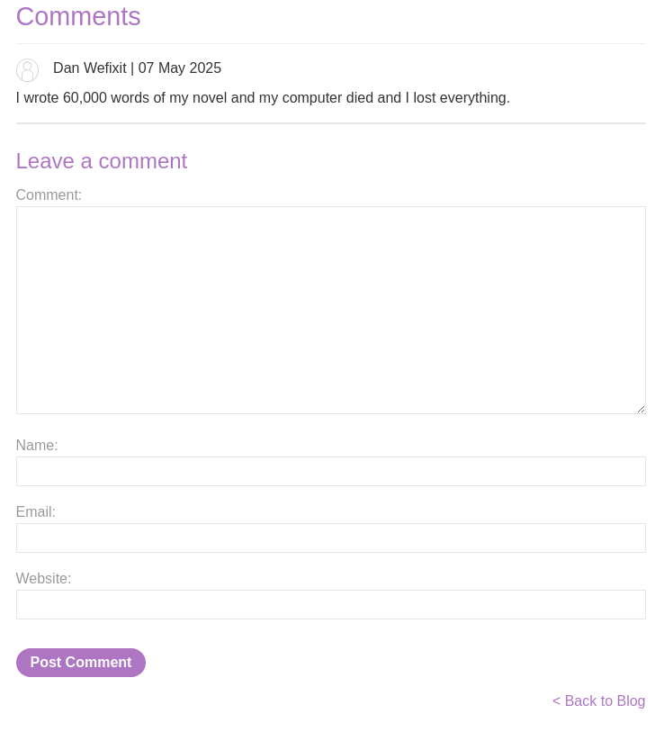
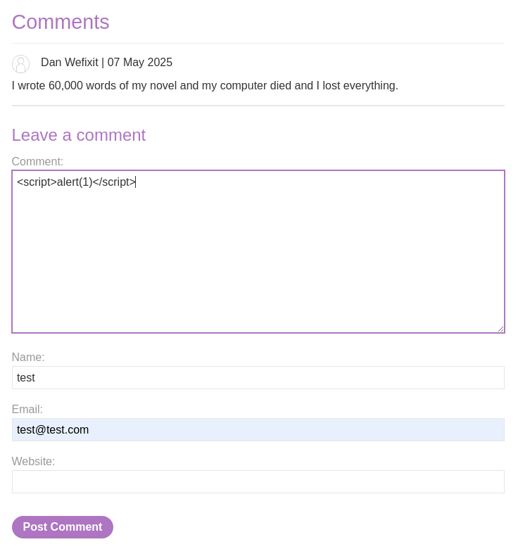
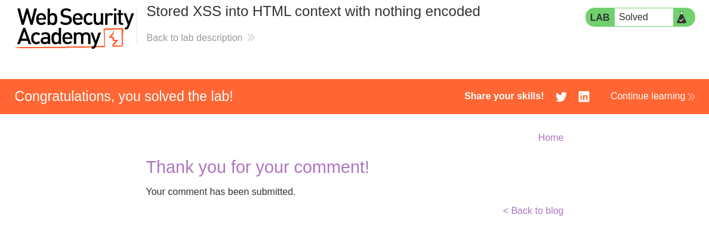
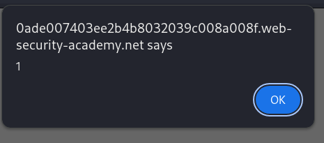

# Lab: Stored XSS into HTML context with nothing encoded
This lab contains a stored cross-site scripting vulnerability in the comment functionality.

To solve this lab, submit a comment that calls the alert function when the blog post is viewed.

# Solution
The site seems to be a blog where a user can comment on individual blog posts.  

Adding script tags in the comments form.  

Entering the blog post again executes the script.  
