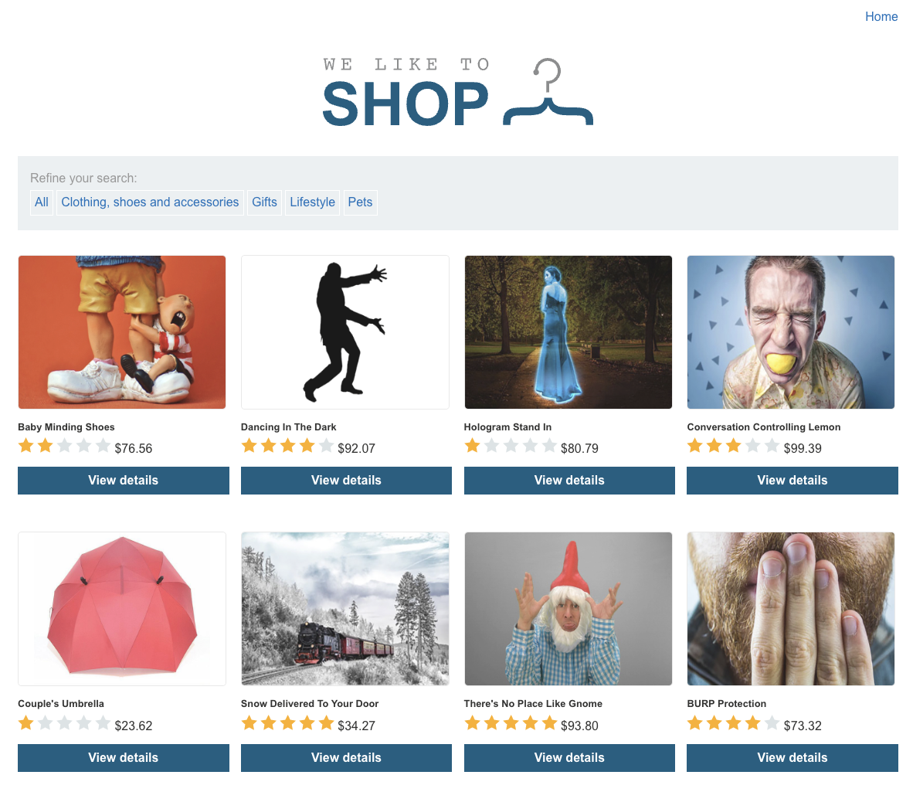
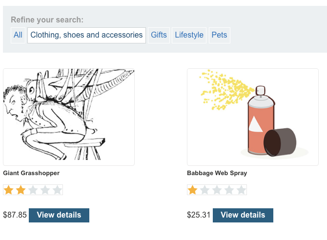
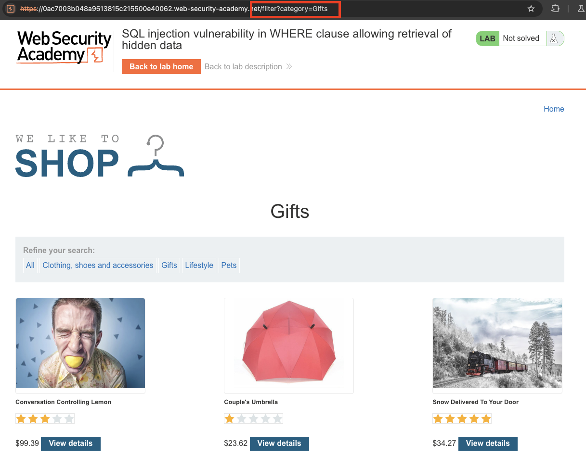
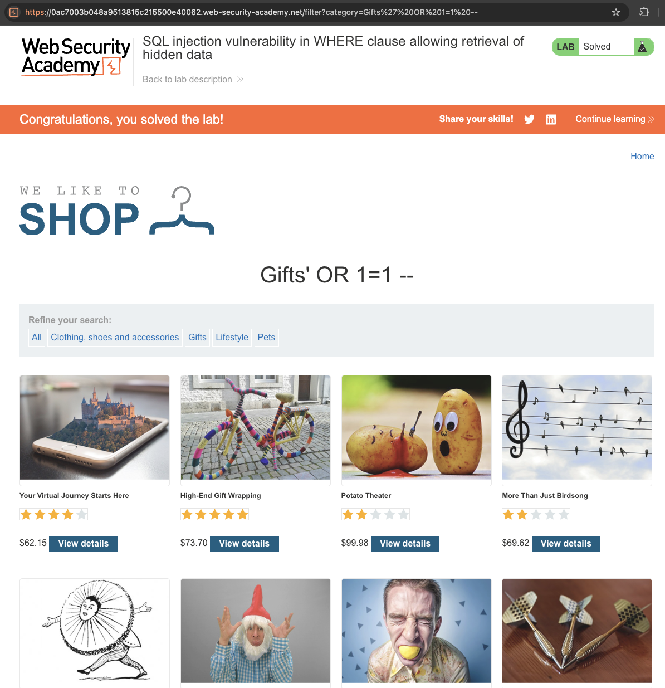

# Lab: SQL injection vulnerability in WHERE clause allowing retrieval of hidden data
This lab contains a SQL injection vulnerability in the product category filter. When the user selects a category, the application carries out a SQL query like the following:

`SELECT * FROM products WHERE category = 'Gifts' AND released = 1`

To solve the lab, perform a SQL injection attack that causes the application to display one or more unreleased products.

# Solution
When entering the page the user is presented with a grid of product sold in the shop. Over the grid there is a filter function.  





And by clikcing the filter function the query ```category``` is set to whatever category chosen by the user.   


And by entering the SQL query behind the real selected category the database returns all products, even the hidden ones.

```sql
' OR 1=1 --
```

