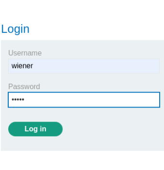
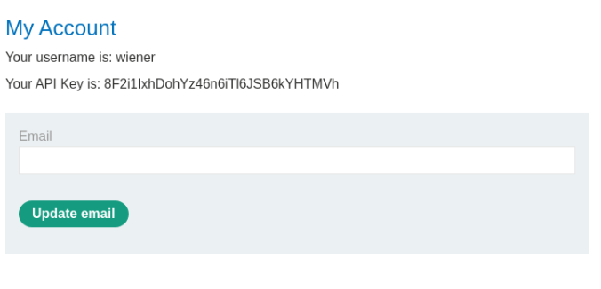
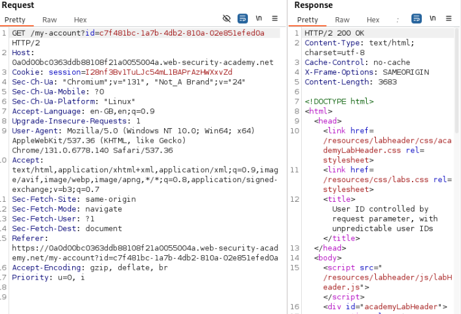
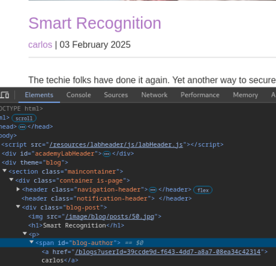
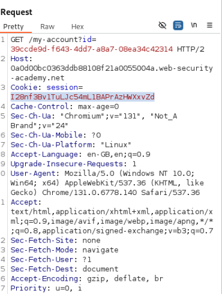
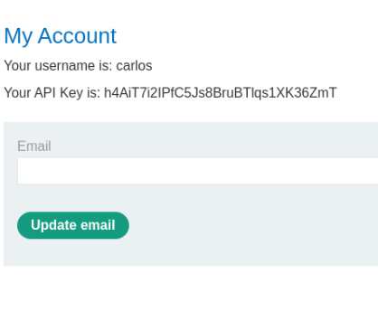

## Lab: User ID controlled by request parameter, with unpredictable user IDs
This lab has a horizontal privilege escalation vulnerability on the user account page, but identifies users with GUIDs.

To solve the lab, find the GUID for `carlos`, then submit his API key as the solution.

You can log in to your own account using the following credentials: `wiener:peter`

## Solution
Use provided credentials to login

When logging in we can see that the id for the user is a random uuid and not sequential, so guessing is out of question.

Poking around the site a little bit we find a blog post created by the target account (carlos). The username of the author is a link, linking to the blog posts created by that user. The link contains a userid...

And by changing the value of id on the "my-account" endpoint to the carlos id we get access to carlos account page instead.

