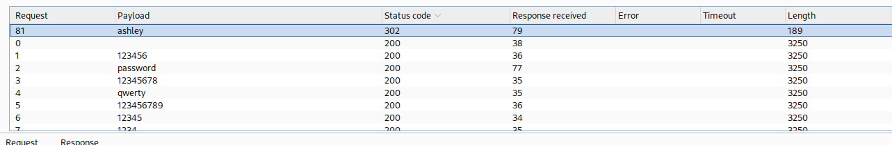

## Lab: Username enumeration via different responses
 This lab is vulnerable to username enumeration and password brute-force attacks. It has an account with a predictable username and password, which can be found in the following wordlists:

    Candidate usernames
    Candidate passwords

To solve the lab, enumerate a valid username, brute-force this user's password, then access their account page. 

# Solution
Accessing the login page and entering a random password to get the endpoint into Burpsuite.  


We also got an hint here that the username is invalid. This could make it easier to use brute forcing to find a username that is valid.  


Using the Intruder we could check if any username in the provided wordlist is a valid username through bruteforce.  


With the Intruder we can see one request that get a bigger response than all the others, this is probably a valid username.  


Also in the response we can see that the application now returns "Incorrect password" instead of "Invalid username" like before, confirming that the username "auction" is valid.  
```html
<h1>Login</h1>
	<section>
         <p class=is-warning>Incorrect password</p>
             <form class=login-form method=POST action="/login">
                 <label>Username</label>
                 <input required type=username name="username" autofocus>
                 <label>Password</label>
                 <input required type=password name="password">
                 <button class=button type=submit> Log in </button>
             </form>
    </section>
```


Now let's do the same with the password.  


We find that one request gets a redirect status code (302) instead of an 200. It looks like we found a password for the user "auction".  



Testing the credentials in the application directly, we get a successful login.  
