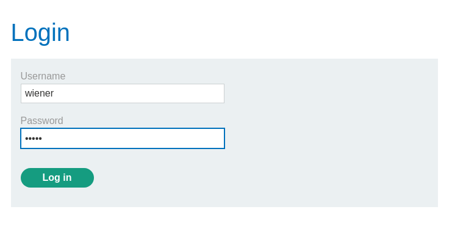
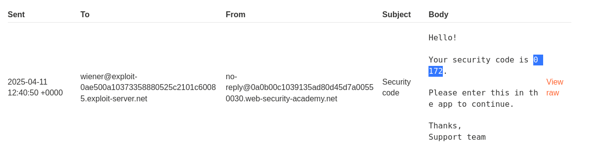
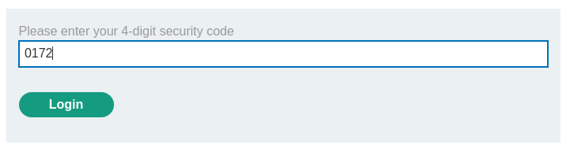
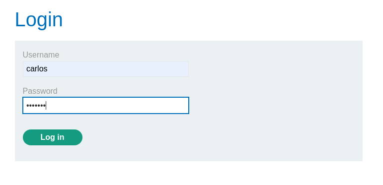
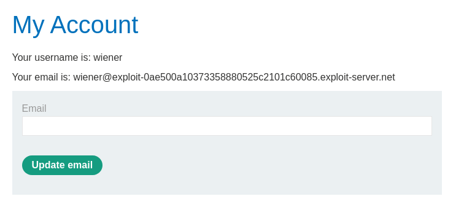
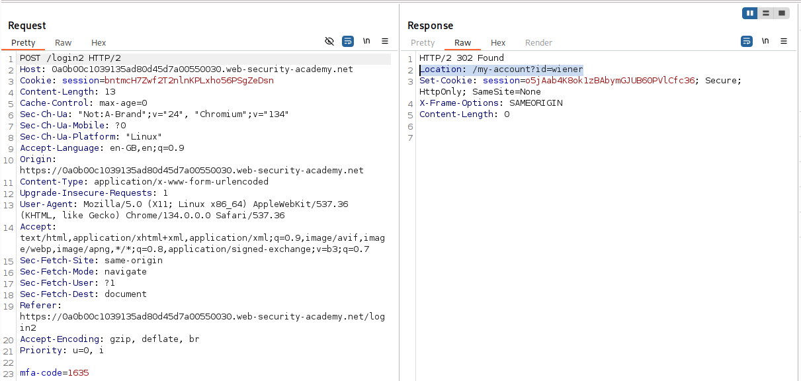
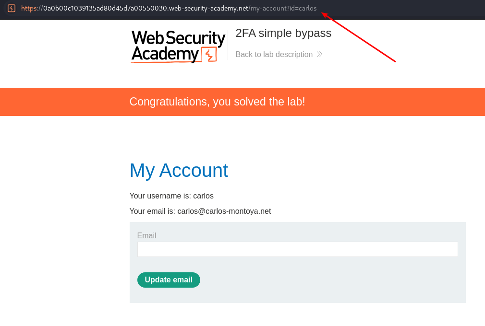

# Lab: 2FA simple bypass

This lab's two-factor authentication can be bypassed. You have already obtained a valid username and password, but do not have access to the user's 2FA verification code. To solve the lab, access Carlos's account page.

    Your credentials: wiener:peter
    Victim's credentials carlos:montoya

## Solution

We start by login in with the provided credentials ```wiener:peter```.  


We get a code in the email client.  



Entering the code the user gets access to the "my-account" endpoint.  



Let's try using the victim's credentials.  
  



This is the request and response. And we are interested in the endpoint the user gets redirected to on a successful login.  



By using the format from the successful login, just changing the id query to the victim username we can bypass the MFA.  
