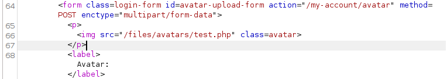
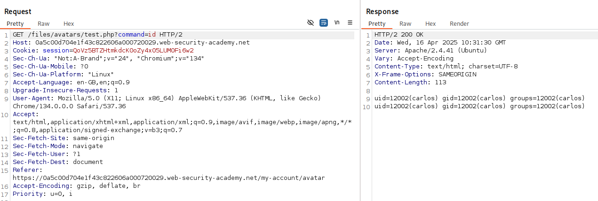

# Lab: Web shell upload via Content-Type restriction bypass
This lab contains a vulnerable image upload function. It attempts to prevent users from uploading unexpected file types, but relies on checking user-controllable input to verify this.

To solve the lab, upload a basic PHP web shell and use it to exfiltrate the contents of the file /home/carlos/secret. Submit this secret using the button provided in the lab banner.

You can log in to your own account using the following credentials: wiener:peter

# Solution
After login we see a input for uploading files to be used as avatars.  


Let's try to upload the script we used in previous lab.
But this time we get this error:  


We try to change the "Content-Type" header to see if that is were the validation occurs.  We leave the file extension the same for now.

And we get a successful response that our file has been uploaded.  


And requesting the ```/my-account``` endpoint again we can see the a tag containing the endpoint to our file.  



And making a request to the endpoint with a command, we get a successful response but the results are doubled.  



Let's cat the secret and use the half of the string returned in the response (because the results is doubled):  


