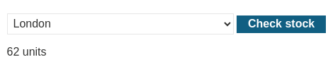
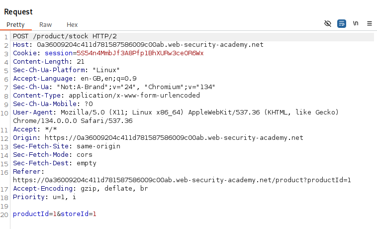
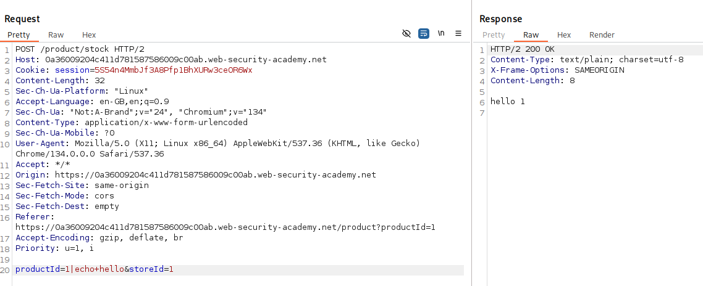
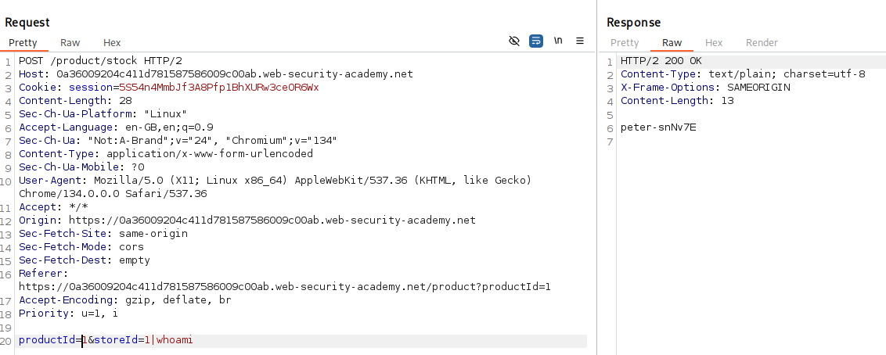
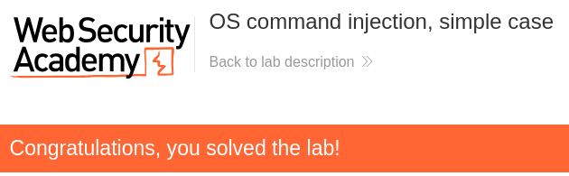

# Lab: OS command injection, simple case
This lab contains an OS command injection vulnerability in the product stock checker.

The application executes a shell command containing user-supplied product and store IDs, and returns the raw output from the command in its response.

To solve the lab, execute the ```whoami``` command to determine the name of the current user.

# Solution:
By checking the product of the site we can see the function to get the units that are in stock.  



And the request contains two parameters (productId and storeId).  



Through trial and error we found that by adding a "|" character between the parameter value and our command we get a successful execution.  



Now we just enter the ```whoami``` command at the end and get the user in the response.  



