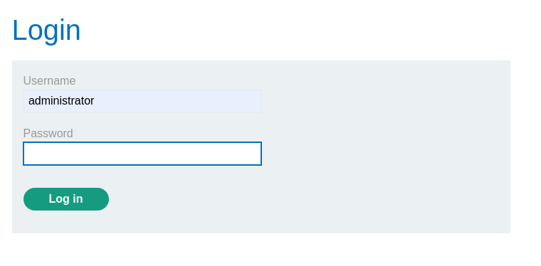
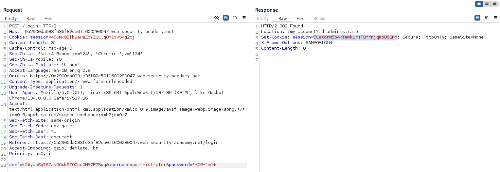
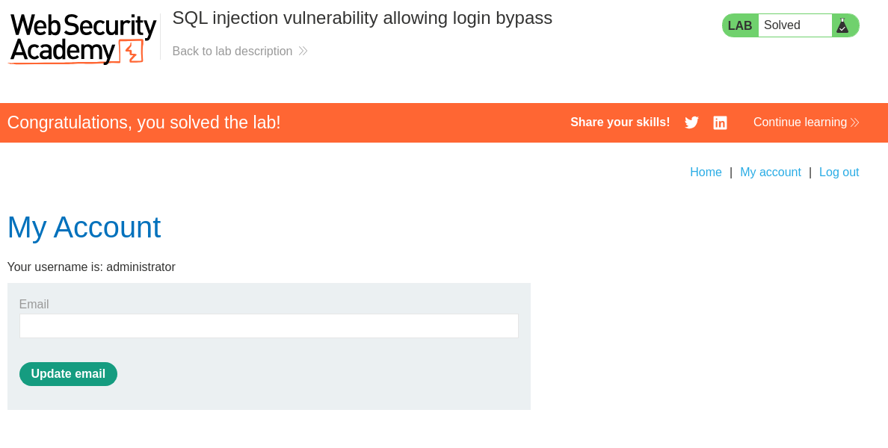

# Lab: SQL injection vulnerability allowing login bypass
This lab contains a SQL injection vulnerability in the login function.

To solve the lab, perform a SQL injection attack that logs in to the application as the ```administrator``` user.

# Solution
Accessing the login page we see the login form and let's try to enter ```' OR 1=1--```   



This is what the request looks like. And we get a 302 and a session cookie we could use.  



But entering the SQL query (```' OR 1=1--```) in the password field we can login using the browser instead.   
