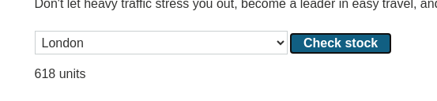
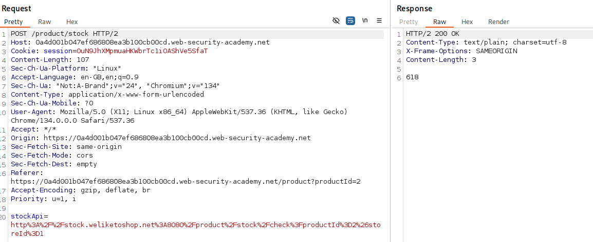
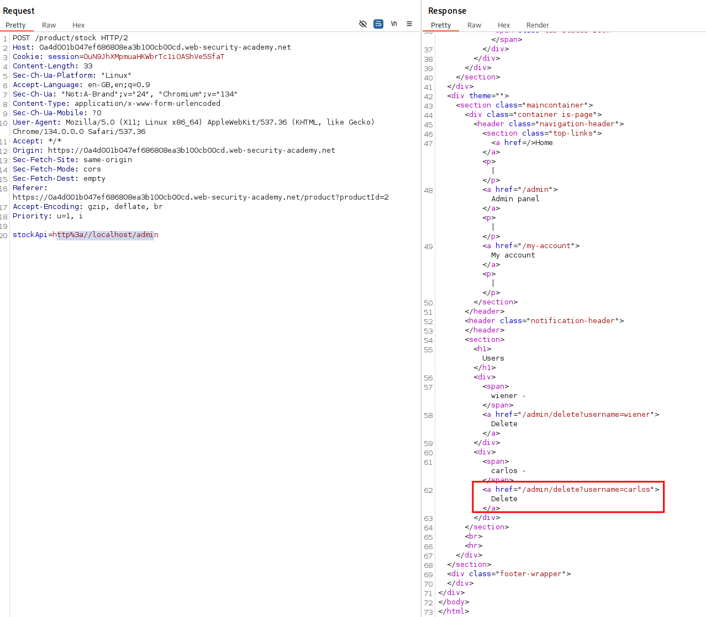
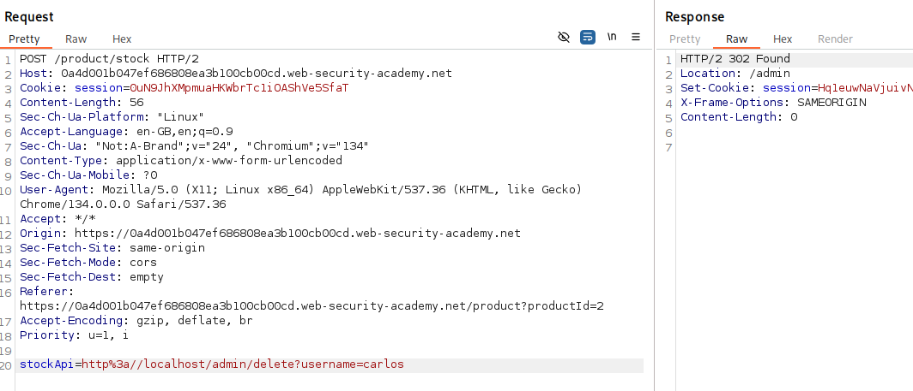
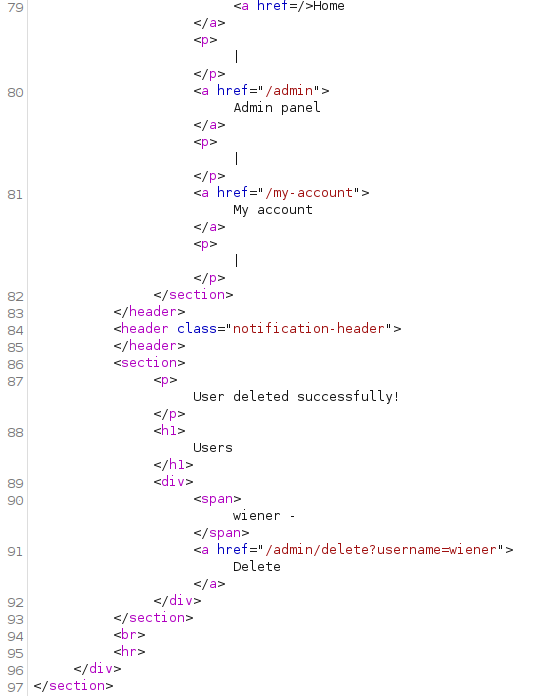
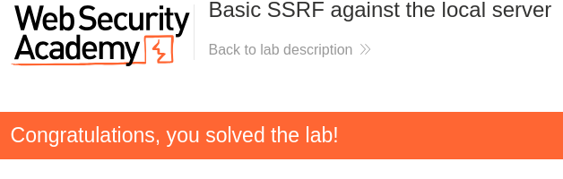

# Lab:
This lab has a stock check feature which fetches data from an internal system.

To solve the lab, change the stock check URL to access the admin interface at http://localhost/admin and delete the user carlos.

# Solution:

Navigating to a product on the page we see the function stated in lab instruction. When clicking the button "Check stock" we get the number of units back, presented in text under the input field.  



This is how the request and response looks like. And in the request we can see that a URL encoded string for the API endpoint is included. This is sent from the client and could be changed by the user.   



This is what the decoded URI looks like: 
```http://stock.weliketoshop.net:8080/product/stock/check?productId=2&storeId=1```
And by changing the URI to the URI given to us in the lab instructions, we get the HTML of the admin dashboard and we can see the endpoint where the user "carlos" can be deleted.   



When the request is made to the endpoint we get a 302, redirecting us to the dashboard again. No error, let's check the ```/admin``` endpoint again and the page itself.  



Here we can see that the "User is deleted successfully!" message is returned to the client and in the ```<section>``` with the users, only the user "wiener" left.  
  
