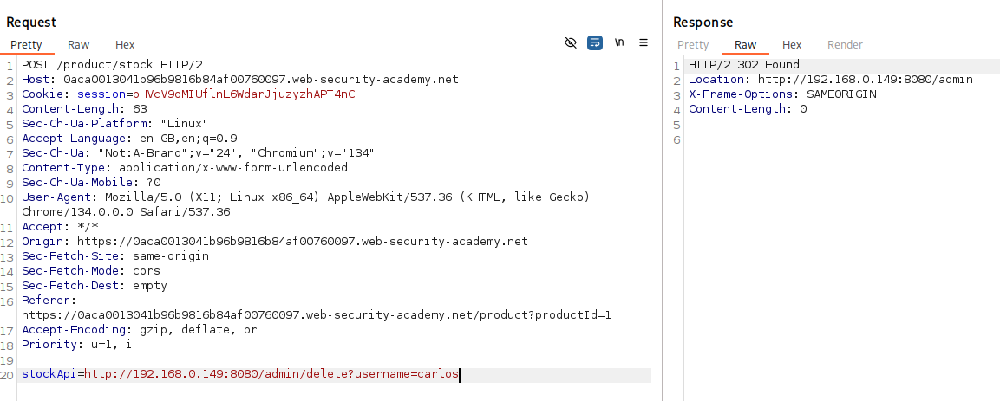

# Lab
This lab has a stock check feature which fetches data from an internal system.

To solve the lab, use the stock check functionality to scan the internal 192.168.0.X range for an admin interface on port 8080, then use it to delete the user carlos.

# Solution

Entering the site again we see again (see SSRF Lab_1) that the functionality to check the stock is present and seems to works in the same way. The client has a URI sent to the server that fetches the number of items in stock.  


The decoded URI:
```http://192.168.0.1:8080/product/stock/check?productId=1&storeId=1```
Using the same IP in the request didn't work. We get an 400 error back.    


In the lab instruction it says "scan", so the admin is probably on another host.
Using the Intruder in Burpsuite to send a request to a different IP until we get a successful response. Enumerating from host IP 1 to 255 to cover the whole IP range.  


Using the Intruder to send requests, we see that the IP 192.168.0.149 returns a 200 status code where every other failed request returning a 500, meaning we got a successful request when trying to find the ```/admin``` endpoint on 192.168.0.149.  


By sending the successful request to the Repeater we can send the request again and see the HTML of the admin dashboard and see the endpoint we need to hit through the "stockApi" parameter.  


Like in Lab_1 we get a 302, and get redirected to /admin again.



And by going back to the /admin endpoint we see the message and the list of users left.  


